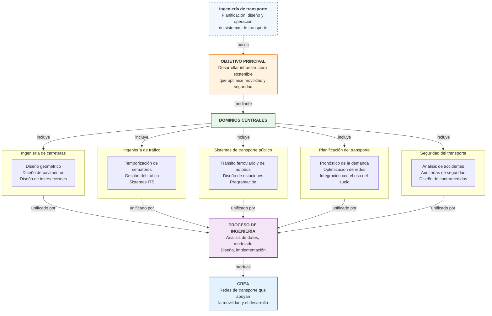

```mermaid
flowchart TD
    A[<b>Ingeniería de transporte</b><br>Planificación, diseño y operación<br>de sistemas de transporte]:::title
    B[<b>OBJETIVO PRINCIPAL</b><br>Desarrollar infraestructura sostenible<br>que optimice movilidad y seguridad]:::objective
    C[<b>DOMINIOS CENTRALES</b>]:::domains
    
    subgraph D[Ingeniería de carreteras]
        D1[Diseño geométrico<br>Diseño de pavimentos<br>Diseño de intersecciones]
    end
    
    subgraph E[Ingeniería de tráfico]
        E1[Temporización de semáforos<br>Gestión del tráfico<br>Sistemas ITS]
    end
    
    subgraph F[Sistemas de transporte público]
        F1[Tránsito ferroviario y de autobús<br>Diseño de estaciones<br>Programación]
    end
    
    subgraph G[Planificación del transporte]
        G1[Pronóstico de la demanda<br>Optimización de redes<br>Integración con el uso del suelo]
    end
    
    subgraph H[Seguridad del transporte]
        H1[Análisis de accidentes<br>Auditorías de seguridad<br>Diseño de contramedidas]
    end
    
    I[<b>PROCESO DE INGENIERÍA</b><br>Análisis de datos, modelado<br>Diseño, implementación]:::process
    
    J[<b>CREA</b><br>Redes de transporte que apoyan<br>la movilidad y el desarrollo]:::outcome
    
    A -->|busca| B
    B -->|mediante| C
    C -->|incluye| D
    C -->|incluye| E
    C -->|incluye| F
    C -->|incluye| G
    C -->|incluye| H
    D & E & F & G & H -->|unificado por| I
    I -->|produce| J
    
    classDef title fill:#f0f7ff,stroke:#4a6fa5,stroke-width:2px,color:#333,stroke-dasharray: 5 5
    classDef objective fill:#fff3e0,stroke:#ef6c00,stroke-width:2px,color:#333
    classDef domains fill:#e8f5e9,stroke:#2e7d32,stroke-width:2px,color:#333
    classDef process fill:#f3e5f5,stroke:#7b1fa2,stroke-width:2px,color:#333
    classDef outcome fill:#e3f2fd,stroke:#1565c0,stroke-width:2px,color:#333
```
