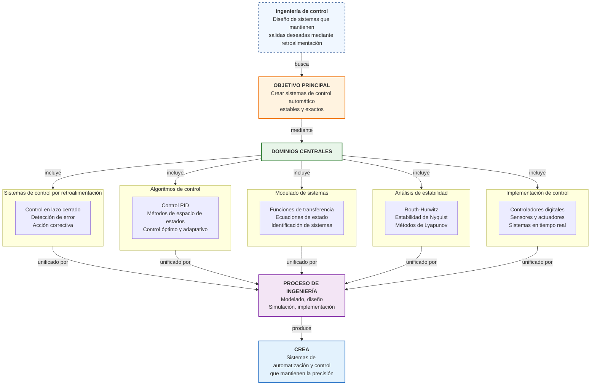

```mermaid
flowchart TD
    A[<b>Ingeniería de control</b><br>Diseño de sistemas que mantienen<br>salidas deseadas mediante retroalimentación]:::title
    B[<b>OBJETIVO PRINCIPAL</b><br>Crear sistemas de control automático<br>estables y exactos]:::objective
    C[<b>DOMINIOS CENTRALES</b>]:::domains
    
    subgraph D[Sistemas de control por retroalimentación]
        D1[Control en lazo cerrado<br>Detección de error<br>Acción correctiva]
    end
    
    subgraph E[Algoritmos de control]
        E1[Control PID<br>Métodos de espacio de estados<br>Control óptimo y adaptativo]
    end
    
    subgraph F[Modelado de sistemas]
        F1[Funciones de transferencia<br>Ecuaciones de estado<br>Identificación de sistemas]
    end
    
    subgraph G[Análisis de estabilidad]
        G1[Routh-Hurwitz<br>Estabilidad de Nyquist<br>Métodos de Lyapunov]
    end
    
    subgraph H[Implementación de control]
        H1[Controladores digitales<br>Sensores y actuadores<br>Sistemas en tiempo real]
    end
    
    I[<b>PROCESO DE INGENIERÍA</b><br>Modelado, diseño<br>Simulación, implementación]:::process
    
    J[<b>CREA</b><br>Sistemas de automatización y control<br>que mantienen la precisión]:::outcome
    
    A -->|busca| B
    B -->|mediante| C
    C -->|incluye| D
    C -->|incluye| E
    C -->|incluye| F
    C -->|incluye| G
    C -->|incluye| H
    D & E & F & G & H -->|unificado por| I
    I -->|produce| J
    
    classDef title fill:#f0f7ff,stroke:#4a6fa5,stroke-width:2px,color:#333,stroke-dasharray: 5 5
    classDef objective fill:#fff3e0,stroke:#ef6c00,stroke-width:2px,color:#333
    classDef domains fill:#e8f5e9,stroke:#2e7d32,stroke-width:2px,color:#333
    classDef process fill:#f3e5f5,stroke:#7b1fa2,stroke-width:2px,color:#333
    classDef outcome fill:#e3f2fd,stroke:#1565c0,stroke-width:2px,color:#333
```
