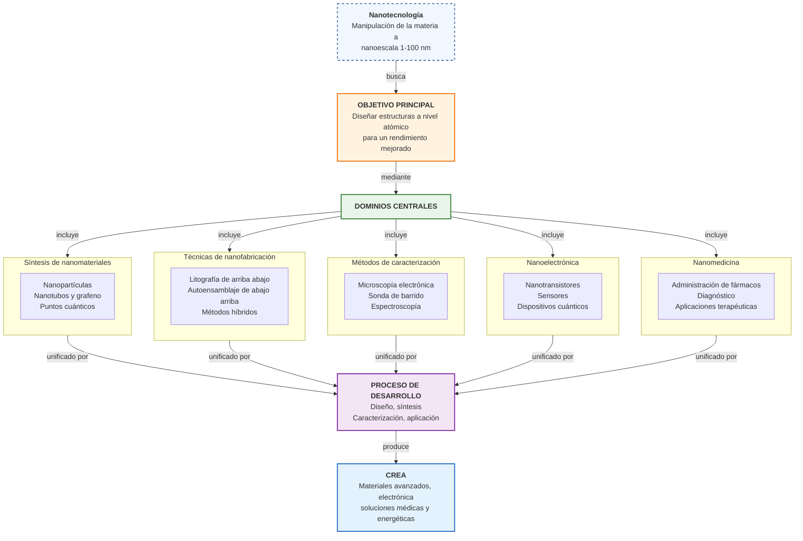

```mermaid
flowchart TD
    A[<b>Nanotecnología</b><br>Manipulación de la materia a<br>nanoescala 1-100 nm]:::title
    B[<b>OBJETIVO PRINCIPAL</b><br>Diseñar estructuras a nivel atómico<br>para un rendimiento mejorado]:::objective
    C[<b>DOMINIOS CENTRALES</b>]:::domains
    
    subgraph D[Síntesis de nanomateriales]
        D1[Nanopartículas<br>Nanotubos y grafeno<br>Puntos cuánticos]
    end
    
    subgraph E[Técnicas de nanofabricación]
        E1[Litografía de arriba abajo<br>Autoensamblaje de abajo arriba<br>Métodos híbridos]
    end
    
    subgraph F[Métodos de caracterización]
        F1[Microscopía electrónica<br>Sonda de barrido<br>Espectroscopía]
    end
    
    subgraph G[Nanoelectrónica]
        G1[Nanotransistores<br>Sensores<br>Dispositivos cuánticos]
    end
    
    subgraph H[Nanomedicina]
        H1[Administración de fármacos<br>Diagnóstico<br>Aplicaciones terapéuticas]
    end
    
    I[<b>PROCESO DE DESARROLLO</b><br>Diseño, síntesis<br>Caracterización, aplicación]:::process
    
    J[<b>CREA</b><br>Materiales avanzados, electrónica<br>soluciones médicas y energéticas]:::outcome
    
    A -->|busca| B
    B -->|mediante| C
    C -->|incluye| D
    C -->|incluye| E
    C -->|incluye| F
    C -->|incluye| G
    C -->|incluye| H
    D & E & F & G & H -->|unificado por| I
    I -->|produce| J
    
    classDef title fill:#f0f7ff,stroke:#4a6fa5,stroke-width:2px,color:#333,stroke-dasharray: 5 5
    classDef objective fill:#fff3e0,stroke:#ef6c00,stroke-width:2px,color:#333
    classDef domains fill:#e8f5e9,stroke:#2e7d32,stroke-width:2px,color:#333
    classDef process fill:#f3e5f5,stroke:#7b1fa2,stroke-width:2px,color:#333
    classDef outcome fill:#e3f2fd,stroke:#1565c0,stroke-width:2px,color:#333
```
