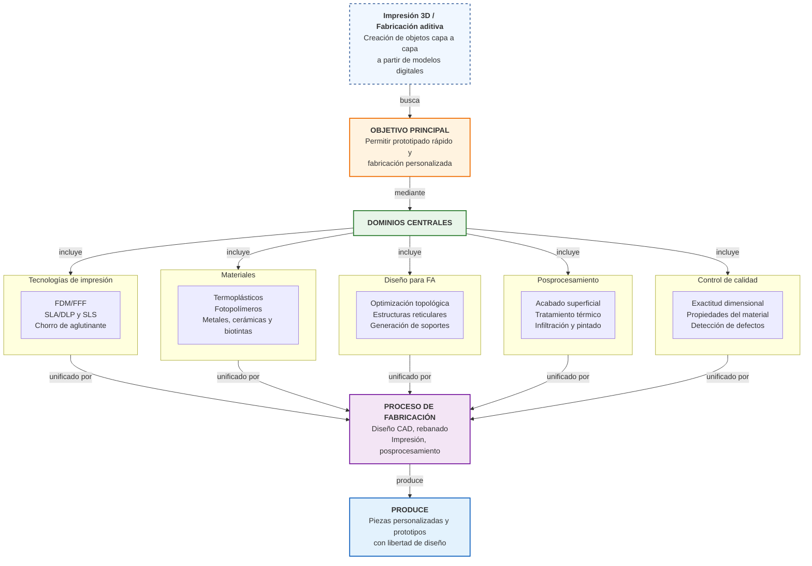

```mermaid
flowchart TD
    A[<b>Impresión 3D / Fabricación aditiva</b><br>Creación de objetos capa a capa<br>a partir de modelos digitales]:::title
    B[<b>OBJETIVO PRINCIPAL</b><br>Permitir prototipado rápido y<br>fabricación personalizada]:::objective
    C[<b>DOMINIOS CENTRALES</b>]:::domains
    
    subgraph D[Tecnologías de impresión]
        D1[FDM/FFF<br>SLA/DLP y SLS<br>Chorro de aglutinante]
    end
    
    subgraph E[Materiales]
        E1[Termoplásticos<br>Fotopolímeros<br>Metales, cerámicas y biotintas]
    end
    
    subgraph F[Diseño para FA]
        F1[Optimización topológica<br>Estructuras reticulares<br>Generación de soportes]
    end
    
    subgraph G[Posprocesamiento]
        G1[Acabado superficial<br>Tratamiento térmico<br>Infiltración y pintado]
    end
    
    subgraph H[Control de calidad]
        H1[Exactitud dimensional<br>Propiedades del material<br>Detección de defectos]
    end
    
    I[<b>PROCESO DE FABRICACIÓN</b><br>Diseño CAD, rebanado<br>Impresión, posprocesamiento]:::process
    
    J[<b>PRODUCE</b><br>Piezas personalizadas y prototipos<br>con libertad de diseño]:::outcome
    
    A -->|busca| B
    B -->|mediante| C
    C -->|incluye| D
    C -->|incluye| E
    C -->|incluye| F
    C -->|incluye| G
    C -->|incluye| H
    D & E & F & G & H -->|unificado por| I
    I -->|produce| J
    
    classDef title fill:#f0f7ff,stroke:#4a6fa5,stroke-width:2px,color:#333,stroke-dasharray: 5 5
    classDef objective fill:#fff3e0,stroke:#ef6c00,stroke-width:2px,color:#333
    classDef domains fill:#e8f5e9,stroke:#2e7d32,stroke-width:2px,color:#333
    classDef process fill:#f3e5f5,stroke:#7b1fa2,stroke-width:2px,color:#333
    classDef outcome fill:#e3f2fd,stroke:#1565c0,stroke-width:2px,color:#333
```
