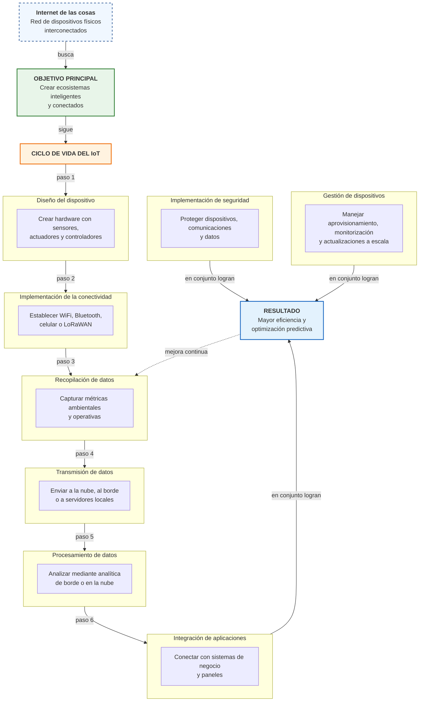

```mermaid
flowchart TD
    A[<b>Internet de las cosas</b><br>Red de dispositivos físicos<br>interconectados]:::title
    B[<b>OBJETIVO PRINCIPAL</b><br>Crear ecosistemas inteligentes<br>y conectados]:::goal
    C[<b>CICLO DE VIDA DEL IoT</b>]:::process
    
    subgraph D[Diseño del dispositivo]
        D1[Crear hardware con sensores,<br>actuadores y controladores]
    end
    
    subgraph E[Implementación de la conectividad]
        E1[Establecer WiFi, Bluetooth,<br>celular o LoRaWAN]
    end
    
    subgraph F[Recopilación de datos]
        F1[Capturar métricas ambientales<br>y operativas]
    end
    
    subgraph G[Transmisión de datos]
        G1[Enviar a la nube, al borde<br>o a servidores locales]
    end
    
    subgraph H[Procesamiento de datos]
        H1[Analizar mediante analítica<br>de borde o en la nube]
    end
    
    subgraph I[Integración de aplicaciones]
        I1[Conectar con sistemas de negocio<br>y paneles]
    end
    
    subgraph J[Implementación de seguridad]
        J1[Proteger dispositivos, comunicaciones<br>y datos]
    end
    
    subgraph K[Gestión de dispositivos]
        K1[Manejar aprovisionamiento, monitorización<br>y actualizaciones a escala]
    end
    
    L[<b>RESULTADO</b><br>Mayor eficiencia y<br>optimización predictiva]:::outcome
    
    A -->|busca| B
    B -->|sigue| C
    C -->|paso 1| D
    D -->|paso 2| E
    E -->|paso 3| F
    F -->|paso 4| G
    G -->|paso 5| H
    H -->|paso 6| I
    I & J & K -->|en conjunto logran| L
    L -.->|mejora continua| F
    
    classDef title fill:#f0f7ff,stroke:#4a6fa5,stroke-width:2px,color:#333,stroke-dasharray:5 5
    classDef goal fill:#e8f5e9,stroke:#2e7d32,stroke-width:2px,color:#333
    classDef process fill:#fff3e0,stroke:#ef6c00,stroke-width:2px,color:#333
    classDef outcome fill:#e3f2fd,stroke:#1565c0,stroke-width:2px,color:#333
```
