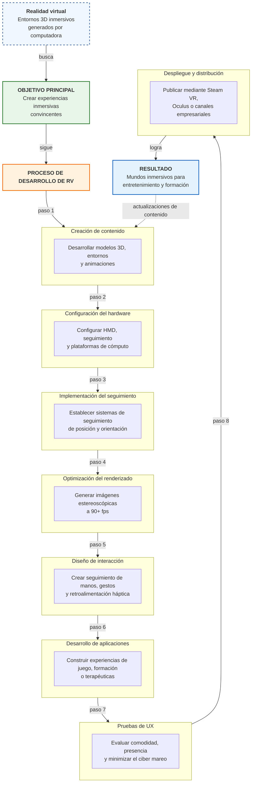

```mermaid
flowchart TD
    A[<b>Realidad virtual</b><br>Entornos 3D inmersivos<br>generados por computadora]:::title
    B[<b>OBJETIVO PRINCIPAL</b><br>Crear experiencias inmersivas<br>convincentes]:::goal
    C[<b>PROCESO DE DESARROLLO DE RV</b>]:::process
    
    subgraph D[Creación de contenido]
        D1[Desarrollar modelos 3D, entornos<br>y animaciones]
    end
    
    subgraph E[Configuración del hardware]
        E1[Configurar HMD, seguimiento<br>y plataformas de cómputo]
    end
    
    subgraph F[Implementación del seguimiento]
        F1[Establecer sistemas de seguimiento<br>de posición y orientación]
    end
    
    subgraph G[Optimización del renderizado]
        G1[Generar imágenes estereoscópicas<br>a 90+ fps]
    end
    
    subgraph H[Diseño de interacción]
        H1[Crear seguimiento de manos, gestos<br>y retroalimentación háptica]
    end
    
    subgraph I[Desarrollo de aplicaciones]
        I1[Construir experiencias de juego, formación<br>o terapéuticas]
    end
    
    subgraph J[Pruebas de UX]
        J1[Evaluar comodidad, presencia<br>y minimizar el ciber mareo]
    end
    
    subgraph K[Despliegue y distribución]
        K1[Publicar mediante Steam VR,<br>Oculus o canales empresariales]
    end
    
    L[<b>RESULTADO</b><br>Mundos inmersivos para<br>entretenimiento y formación]:::outcome
    
    A -->|busca| B
    B -->|sigue| C
    C -->|paso 1| D
    D -->|paso 2| E
    E -->|paso 3| F
    F -->|paso 4| G
    G -->|paso 5| H
    H -->|paso 6| I
    I -->|paso 7| J
    J -->|paso 8| K
    K -->|logra| L
    L -.->|actualizaciones de contenido| D
    
    classDef title fill:#f0f7ff,stroke:#4a6fa5,stroke-width:2px,color:#333,stroke-dasharray:5 5
    classDef goal fill:#e8f5e9,stroke:#2e7d32,stroke-width:2px,color:#333
    classDef process fill:#fff3e0,stroke:#ef6c00,stroke-width:2px,color:#333
    classDef outcome fill:#e3f2fd,stroke:#1565c0,stroke-width:2px,color:#333
```
