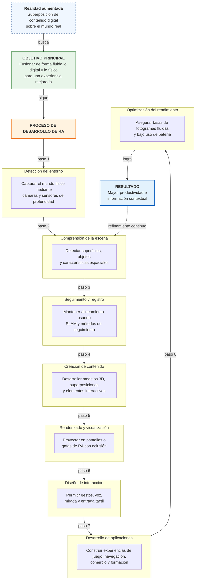

```mermaid
flowchart TD
    A[<b>Realidad aumentada</b><br>Superposición de contenido digital<br>sobre el mundo real]:::title
    B[<b>OBJETIVO PRINCIPAL</b><br>Fusionar de forma fluida lo digital y lo físico<br>para una experiencia mejorada]:::goal
    C[<b>PROCESO DE DESARROLLO DE RA</b>]:::process
    
    subgraph D[Detección del entorno]
        D1[Capturar el mundo físico mediante<br>cámaras y sensores de profundidad]
    end
    
    subgraph E[Comprensión de la escena]
        E1[Detectar superficies, objetos<br>y características espaciales]
    end
    
    subgraph F[Seguimiento y registro]
        F1[Mantener alineamiento usando<br>SLAM y métodos de seguimiento]
    end
    
    subgraph G[Creación de contenido]
        G1[Desarrollar modelos 3D, superposiciones<br>y elementos interactivos]
    end
    
    subgraph H[Renderizado y visualización]
        H1[Proyectar en pantallas o<br>gafas de RA con oclusión]
    end
    
    subgraph I[Diseño de interacción]
        I1[Permitir gestos, voz,<br>mirada y entrada táctil]
    end
    
    subgraph J[Desarrollo de aplicaciones]
        J1[Construir experiencias de juego, navegación,<br>comercio y formación]
    end
    
    subgraph K[Optimización del rendimiento]
        K1[Asegurar tasas de fotogramas fluidas<br>y bajo uso de batería]
    end
    
    L[<b>RESULTADO</b><br>Mayor productividad e<br>información contextual]:::outcome
    
    A -->|busca| B
    B -->|sigue| C
    C -->|paso 1| D
    D -->|paso 2| E
    E -->|paso 3| F
    F -->|paso 4| G
    G -->|paso 5| H
    H -->|paso 6| I
    I -->|paso 7| J
    J -->|paso 8| K
    K -->|logra| L
    L -.->|refinamiento continuo| E
    
    classDef title fill:#f0f7ff,stroke:#4a6fa5,stroke-width:2px,color:#333,stroke-dasharray:5 5
    classDef goal fill:#e8f5e9,stroke:#2e7d32,stroke-width:2px,color:#333
    classDef process fill:#fff3e0,stroke:#ef6c00,stroke-width:2px,color:#333
    classDef outcome fill:#e3f2fd,stroke:#1565c0,stroke-width:2px,color:#333
```
