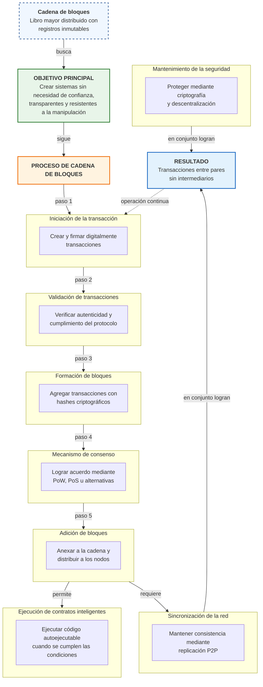

```mermaid
flowchart TD
    A[<b>Cadena de bloques</b><br>Libro mayor distribuido con<br>registros inmutables]:::title
    B[<b>OBJETIVO PRINCIPAL</b><br>Crear sistemas sin necesidad de confianza,<br>transparentes y resistentes a la manipulación]:::goal
    C[<b>PROCESO DE CADENA DE BLOQUES</b>]:::process
    
    subgraph D[Iniciación de la transacción]
        D1[Crear y firmar digitalmente<br>transacciones]
    end
    
    subgraph E[Validación de transacciones]
        E1[Verificar autenticidad y<br>cumplimiento del protocolo]
    end
    
    subgraph F[Formación de bloques]
        F1[Agregar transacciones con<br>hashes criptográficos]
    end
    
    subgraph G[Mecanismo de consenso]
        G1[Lograr acuerdo mediante<br>PoW, PoS u alternativas]
    end
    
    subgraph H[Adición de bloques]
        H1[Anexar a la cadena y<br>distribuir a los nodos]
    end
    
    subgraph I[Ejecución de contratos inteligentes]
        I1[Ejecutar código autoejecutable<br>cuando se cumplen las condiciones]
    end
    
    subgraph J[Sincronización de la red]
        J1[Mantener consistencia mediante<br>replicación P2P]
    end
    
    subgraph K[Mantenimiento de la seguridad]
        K1[Proteger mediante criptografía<br>y descentralización]
    end
    
    L[<b>RESULTADO</b><br>Transacciones entre pares<br>sin intermediarios]:::outcome
    
    A -->|busca| B
    B -->|sigue| C
    C -->|paso 1| D
    D -->|paso 2| E
    E -->|paso 3| F
    F -->|paso 4| G
    G -->|paso 5| H
    H -->|permite| I
    H -->|requiere| J
    J & K -->|en conjunto logran| L
    L -.->|operación continua| D
    
    classDef title fill:#f0f7ff,stroke:#4a6fa5,stroke-width:2px,color:#333,stroke-dasharray:5 5
    classDef goal fill:#e8f5e9,stroke:#2e7d32,stroke-width:2px,color:#333
    classDef process fill:#fff3e0,stroke:#ef6c00,stroke-width:2px,color:#333
    classDef outcome fill:#e3f2fd,stroke:#1565c0,stroke-width:2px,color:#333
```
