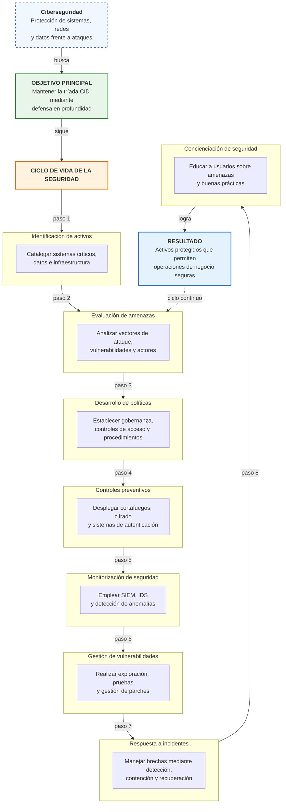

```mermaid
flowchart TD
    A[<b>Ciberseguridad</b><br>Protección de sistemas, redes<br>y datos frente a ataques]:::title
    B[<b>OBJETIVO PRINCIPAL</b><br>Mantener la tríada CID mediante<br>defensa en profundidad]:::goal
    C[<b>CICLO DE VIDA DE LA SEGURIDAD</b>]:::process
    
    subgraph D[Identificación de activos]
        D1[Catalogar sistemas críticos,<br>datos e infraestructura]
    end
    
    subgraph E[Evaluación de amenazas]
        E1[Analizar vectores de ataque,<br>vulnerabilidades y actores]
    end
    
    subgraph F[Desarrollo de políticas]
        F1[Establecer gobernanza,<br>controles de acceso y procedimientos]
    end
    
    subgraph G[Controles preventivos]
        G1[Desplegar cortafuegos, cifrado<br>y sistemas de autenticación]
    end
    
    subgraph H[Monitorización de seguridad]
        H1[Emplear SIEM, IDS<br>y detección de anomalías]
    end
    
    subgraph I[Gestión de vulnerabilidades]
        I1[Realizar exploración, pruebas<br>y gestión de parches]
    end
    
    subgraph J[Respuesta a incidentes]
        J1[Manejar brechas mediante detección,<br>contención y recuperación]
    end
    
    subgraph K[Concienciación de seguridad]
        K1[Educar a usuarios sobre amenazas<br>y buenas prácticas]
    end
    
    L[<b>RESULTADO</b><br>Activos protegidos que permiten<br>operaciones de negocio seguras]:::outcome
    
    A -->|busca| B
    B -->|sigue| C
    C -->|paso 1| D
    D -->|paso 2| E
    E -->|paso 3| F
    F -->|paso 4| G
    G -->|paso 5| H
    H -->|paso 6| I
    I -->|paso 7| J
    J -->|paso 8| K
    K -->|logra| L
    L -.->|ciclo continuo| E
    
    classDef title fill:#f0f7ff,stroke:#4a6fa5,stroke-width:2px,color:#333,stroke-dasharray:5 5
    classDef goal fill:#e8f5e9,stroke:#2e7d32,stroke-width:2px,color:#333
    classDef process fill:#fff3e0,stroke:#ef6c00,stroke-width:2px,color:#333
    classDef outcome fill:#e3f2fd,stroke:#1565c0,stroke-width:2px,color:#333
```
