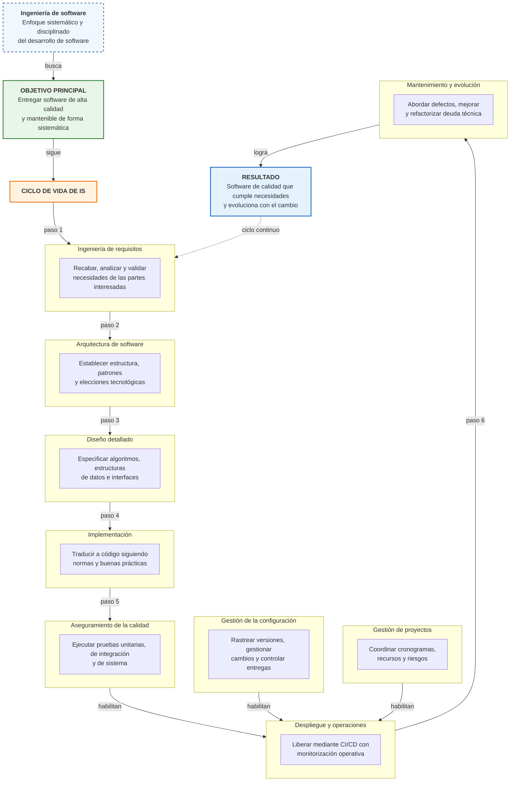

```mermaid
flowchart TD
    A[<b>Ingeniería de software</b><br>Enfoque sistemático y disciplinado<br>del desarrollo de software]:::title
    B[<b>OBJETIVO PRINCIPAL</b><br>Entregar software de alta calidad<br>y mantenible de forma sistemática]:::goal
    C[<b>CICLO DE VIDA DE IS</b>]:::process
    
    subgraph D[Ingeniería de requisitos]
        D1[Recabar, analizar y validar<br>necesidades de las partes interesadas]
    end
    
    subgraph E[Arquitectura de software]
        E1[Establecer estructura, patrones<br>y elecciones tecnológicas]
    end
    
    subgraph F[Diseño detallado]
        F1[Especificar algoritmos, estructuras<br>de datos e interfaces]
    end
    
    subgraph G[Implementación]
        G1[Traducir a código siguiendo<br>normas y buenas prácticas]
    end
    
    subgraph H[Aseguramiento de la calidad]
        H1[Ejecutar pruebas unitarias, de integración<br>y de sistema]
    end
    
    subgraph I[Gestión de la configuración]
        I1[Rastrear versiones, gestionar<br>cambios y controlar entregas]
    end
    
    subgraph J[Gestión de proyectos]
        J1[Coordinar cronogramas,<br>recursos y riesgos]
    end
    
    subgraph K[Despliegue y operaciones]
        K1[Liberar mediante CI/CD con<br>monitorización operativa]
    end
    
    subgraph L[Mantenimiento y evolución]
        L1[Abordar defectos, mejorar<br>y refactorizar deuda técnica]
    end
    
    M[<b>RESULTADO</b><br>Software de calidad que cumple necesidades<br>y evoluciona con el cambio]:::outcome
    
    A -->|busca| B
    B -->|sigue| C
    C -->|paso 1| D
    D -->|paso 2| E
    E -->|paso 3| F
    F -->|paso 4| G
    G -->|paso 5| H
    H & I & J -->|habilitan| K
    K -->|paso 6| L
    L -->|logra| M
    M -.->|ciclo continuo| D
    
    classDef title fill:#f0f7ff,stroke:#4a6fa5,stroke-width:2px,color:#333,stroke-dasharray:5 5
    classDef goal fill:#e8f5e9,stroke:#2e7d32,stroke-width:2px,color:#333
    classDef process fill:#fff3e0,stroke:#ef6c00,stroke-width:2px,color:#333
    classDef outcome fill:#e3f2fd,stroke:#1565c0,stroke-width:2px,color:#333
```
