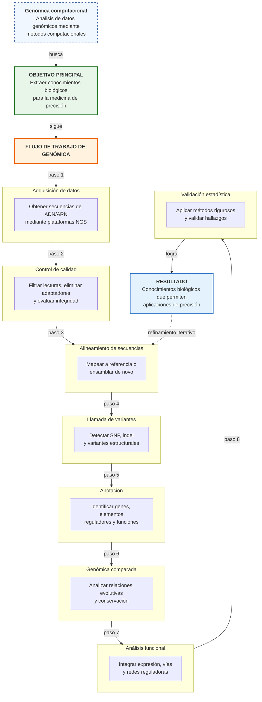

```mermaid
flowchart TD
    A[<b>Genómica computacional</b><br>Análisis de datos genómicos mediante<br>métodos computacionales]:::title
    B[<b>OBJETIVO PRINCIPAL</b><br>Extraer conocimientos biológicos<br>para la medicina de precisión]:::goal
    C[<b>FLUJO DE TRABAJO DE GENÓMICA</b>]:::process
    
    subgraph D[Adquisición de datos]
        D1[Obtener secuencias de ADN/ARN<br>mediante plataformas NGS]
    end
    
    subgraph E[Control de calidad]
        E1[Filtrar lecturas, eliminar adaptadores<br>y evaluar integridad]
    end
    
    subgraph F[Alineamiento de secuencias]
        F1[Mapear a referencia o<br>ensamblar de novo]
    end
    
    subgraph G[Llamada de variantes]
        G1[Detectar SNP, indel<br>y variantes estructurales]
    end
    
    subgraph H[Anotación]
        H1[Identificar genes, elementos<br>reguladores y funciones]
    end
    
    subgraph I[Genómica comparada]
        I1[Analizar relaciones evolutivas<br>y conservación]
    end
    
    subgraph J[Análisis funcional]
        J1[Integrar expresión, vías<br>y redes reguladoras]
    end
    
    subgraph K[Validación estadística]
        K1[Aplicar métodos rigurosos<br>y validar hallazgos]
    end
    
    L[<b>RESULTADO</b><br>Conocimientos biológicos que permiten<br>aplicaciones de precisión]:::outcome
    
    A -->|busca| B
    B -->|sigue| C
    C -->|paso 1| D
    D -->|paso 2| E
    E -->|paso 3| F
    F -->|paso 4| G
    G -->|paso 5| H
    H -->|paso 6| I
    I -->|paso 7| J
    J -->|paso 8| K
    K -->|logra| L
    L -.->|refinamiento iterativo| F
    
    classDef title fill:#f0f7ff,stroke:#4a6fa5,stroke-width:2px,color:#333,stroke-dasharray:5 5
    classDef goal fill:#e8f5e9,stroke:#2e7d32,stroke-width:2px,color:#333
    classDef process fill:#fff3e0,stroke:#ef6c00,stroke-width:2px,color:#333
    classDef outcome fill:#e3f2fd,stroke:#1565c0,stroke-width:2px,color:#333
```
