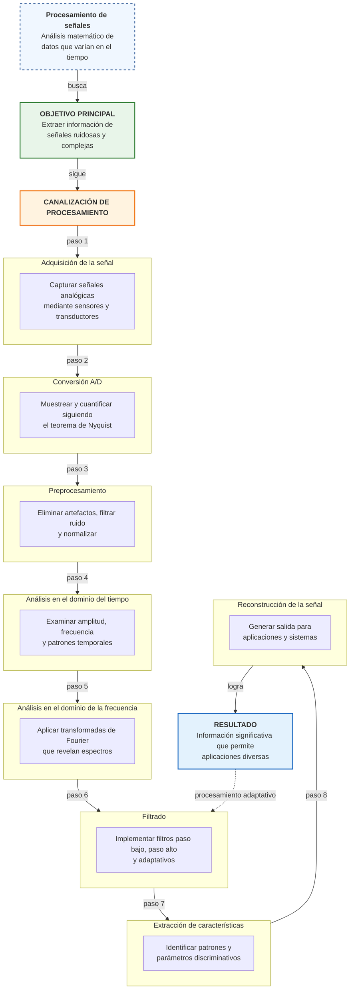

```mermaid
flowchart TD
    A[<b>Procesamiento de señales</b><br>Análisis matemático de<br>datos que varían en el tiempo]:::title
    B[<b>OBJETIVO PRINCIPAL</b><br>Extraer información de<br>señales ruidosas y complejas]:::goal
    C[<b>CANALIZACIÓN DE PROCESAMIENTO</b>]:::process
    
    subgraph D[Adquisición de la señal]
        D1[Capturar señales analógicas<br>mediante sensores y transductores]
    end
    
    subgraph E[Conversión A/D]
        E1[Muestrear y cuantificar siguiendo<br>el teorema de Nyquist]
    end
    
    subgraph F[Preprocesamiento]
        F1[Eliminar artefactos, filtrar ruido<br>y normalizar]
    end
    
    subgraph G[Análisis en el dominio del tiempo]
        G1[Examinar amplitud, frecuencia<br>y patrones temporales]
    end
    
    subgraph H[Análisis en el dominio de la frecuencia]
        H1[Aplicar transformadas de Fourier<br>que revelan espectros]
    end
    
    subgraph I[Filtrado]
        I1[Implementar filtros paso bajo, paso alto<br>y adaptativos]
    end
    
    subgraph J[Extracción de características]
        J1[Identificar patrones y<br>parámetros discriminativos]
    end
    
    subgraph K[Reconstrucción de la señal]
        K1[Generar salida para<br>aplicaciones y sistemas]
    end
    
    L[<b>RESULTADO</b><br>Información significativa que permite<br>aplicaciones diversas]:::outcome
    
    A -->|busca| B
    B -->|sigue| C
    C -->|paso 1| D
    D -->|paso 2| E
    E -->|paso 3| F
    F -->|paso 4| G
    G -->|paso 5| H
    H -->|paso 6| I
    I -->|paso 7| J
    J -->|paso 8| K
    K -->|logra| L
    L -.->|procesamiento adaptativo| I
    
    classDef title fill:#f0f7ff,stroke:#4a6fa5,stroke-width:2px,color:#333,stroke-dasharray:5 5
    classDef goal fill:#e8f5e9,stroke:#2e7d32,stroke-width:2px,color:#333
    classDef process fill:#fff3e0,stroke:#ef6c00,stroke-width:2px,color:#333
    classDef outcome fill:#e3f2fd,stroke:#1565c0,stroke-width:2px,color:#333
```
