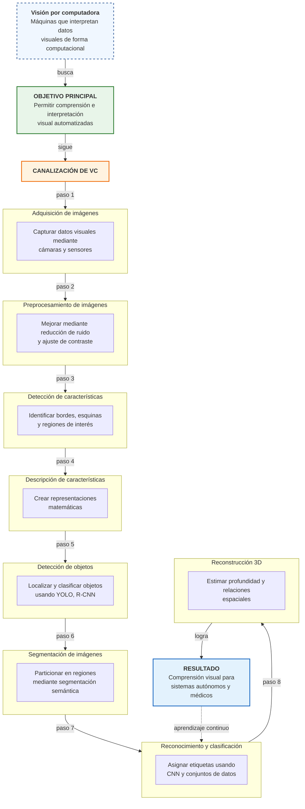

```mermaid
flowchart TD
    A[<b>Visión por computadora</b><br>Máquinas que interpretan datos<br>visuales de forma computacional]:::title
    B[<b>OBJETIVO PRINCIPAL</b><br>Permitir comprensión e interpretación<br>visual automatizadas]:::goal
    C[<b>CANALIZACIÓN DE VC</b>]:::process
    
    subgraph D[Adquisición de imágenes]
        D1[Capturar datos visuales mediante<br>cámaras y sensores]
    end
    
    subgraph E[Preprocesamiento de imágenes]
        E1[Mejorar mediante reducción de ruido<br>y ajuste de contraste]
    end
    
    subgraph F[Detección de características]
        F1[Identificar bordes, esquinas<br>y regiones de interés]
    end
    
    subgraph G[Descripción de características]
        G1[Crear representaciones<br>matemáticas]
    end
    
    subgraph H[Detección de objetos]
        H1[Localizar y clasificar objetos<br>usando YOLO, R-CNN]
    end
    
    subgraph I[Segmentación de imágenes]
        I1[Particionar en regiones<br>mediante segmentación semántica]
    end
    
    subgraph J[Reconocimiento y clasificación]
        J1[Asignar etiquetas usando<br>CNN y conjuntos de datos]
    end
    
    subgraph K[Reconstrucción 3D]
        K1[Estimar profundidad y relaciones<br>espaciales]
    end
    
    L[<b>RESULTADO</b><br>Comprensión visual para<br>sistemas autónomos y médicos]:::outcome
    
    A -->|busca| B
    B -->|sigue| C
    C -->|paso 1| D
    D -->|paso 2| E
    E -->|paso 3| F
    F -->|paso 4| G
    G -->|paso 5| H
    H -->|paso 6| I
    I -->|paso 7| J
    J -->|paso 8| K
    K -->|logra| L
    L -.->|aprendizaje continuo| J
    
    classDef title fill:#f0f7ff,stroke:#4a6fa5,stroke-width:2px,color:#333,stroke-dasharray:5 5
    classDef goal fill:#e8f5e9,stroke:#2e7d32,stroke-width:2px,color:#333
    classDef process fill:#fff3e0,stroke:#ef6c00,stroke-width:2px,color:#333
    classDef outcome fill:#e3f2fd,stroke:#1565c0,stroke-width:2px,color:#333
```
