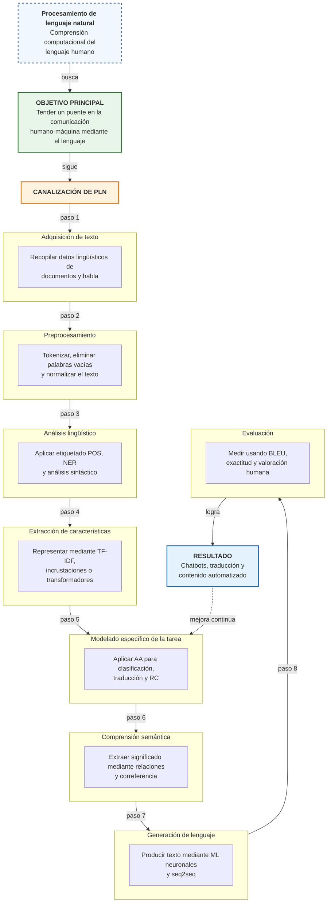

```mermaid
flowchart TD
    A[<b>Procesamiento de lenguaje natural</b><br>Comprensión computacional del<br>lenguaje humano]:::title
    B[<b>OBJETIVO PRINCIPAL</b><br>Tender un puente en la comunicación<br>humano-máquina mediante el lenguaje]:::goal
    C[<b>CANALIZACIÓN DE PLN</b>]:::process
    
    subgraph D[Adquisición de texto]
        D1[Recopilar datos lingüísticos de<br>documentos y habla]
    end
    
    subgraph E[Preprocesamiento]
        E1[Tokenizar, eliminar palabras vacías<br>y normalizar el texto]
    end
    
    subgraph F[Análisis lingüístico]
        F1[Aplicar etiquetado POS, NER<br>y análisis sintáctico]
    end
    
    subgraph G[Extracción de características]
        G1[Representar mediante TF-IDF,<br>incrustaciones o transformadores]
    end
    
    subgraph H[Modelado específico de la tarea]
        H1[Aplicar AA para clasificación,<br>traducción y RC]
    end
    
    subgraph I[Comprensión semántica]
        I1[Extraer significado mediante relaciones<br>y correferencia]
    end
    
    subgraph J[Generación de lenguaje]
        J1[Producir texto mediante ML neuronales<br>y seq2seq]
    end
    
    subgraph K[Evaluación]
        K1[Medir usando BLEU,<br>exactitud y valoración humana]
    end
    
    L[<b>RESULTADO</b><br>Chatbots, traducción y<br>contenido automatizado]:::outcome
    
    A -->|busca| B
    B -->|sigue| C
    C -->|paso 1| D
    D -->|paso 2| E
    E -->|paso 3| F
    F -->|paso 4| G
    G -->|paso 5| H
    H -->|paso 6| I
    I -->|paso 7| J
    J -->|paso 8| K
    K -->|logra| L
    L -.->|mejora continua| H
    
    classDef title fill:#f0f7ff,stroke:#4a6fa5,stroke-width:2px,color:#333,stroke-dasharray:5 5
    classDef goal fill:#e8f5e9,stroke:#2e7d32,stroke-width:2px,color:#333
    classDef process fill:#fff3e0,stroke:#ef6c00,stroke-width:2px,color:#333
    classDef outcome fill:#e3f2fd,stroke:#1565c0,stroke-width:2px,color:#333
```
