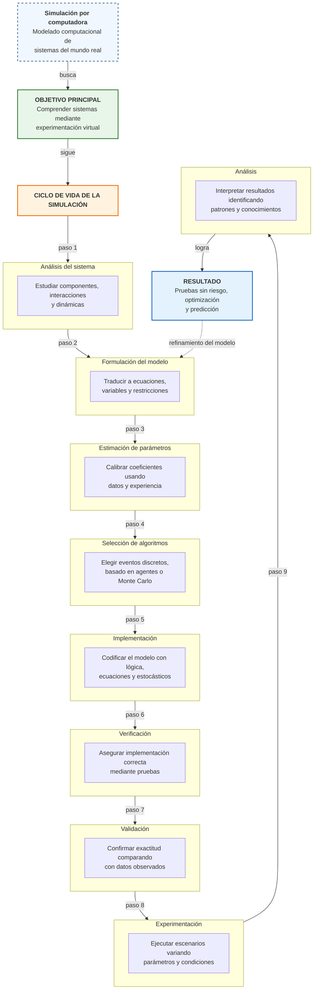

```mermaid
flowchart TD
    A[<b>Simulación por computadora</b><br>Modelado computacional de<br>sistemas del mundo real]:::title
    B[<b>OBJETIVO PRINCIPAL</b><br>Comprender sistemas mediante<br>experimentación virtual]:::goal
    C[<b>CICLO DE VIDA DE LA SIMULACIÓN</b>]:::process
    
    subgraph D[Análisis del sistema]
        D1[Estudiar componentes, interacciones<br>y dinámicas]
    end
    
    subgraph E[Formulación del modelo]
        E1[Traducir a ecuaciones,<br>variables y restricciones]
    end
    
    subgraph F[Estimación de parámetros]
        F1[Calibrar coeficientes usando<br>datos y experiencia]
    end
    
    subgraph G[Selección de algoritmos]
        G1[Elegir eventos discretos,<br>basado en agentes o Monte Carlo]
    end
    
    subgraph H[Implementación]
        H1[Codificar el modelo con lógica,<br>ecuaciones y estocásticos]
    end
    
    subgraph I[Verificación]
        I1[Asegurar implementación correcta<br>mediante pruebas]
    end
    
    subgraph J[Validación]
        J1[Confirmar exactitud comparando<br>con datos observados]
    end
    
    subgraph K[Experimentación]
        K1[Ejecutar escenarios variando<br>parámetros y condiciones]
    end
    
    subgraph L[Análisis]
        L1[Interpretar resultados identificando<br>patrones y conocimientos]
    end
    
    M[<b>RESULTADO</b><br>Pruebas sin riesgo, optimización<br>y predicción]:::outcome
    
    A -->|busca| B
    B -->|sigue| C
    C -->|paso 1| D
    D -->|paso 2| E
    E -->|paso 3| F
    F -->|paso 4| G
    G -->|paso 5| H
    H -->|paso 6| I
    I -->|paso 7| J
    J -->|paso 8| K
    K -->|paso 9| L
    L -->|logra| M
    M -.->|refinamiento del modelo| E
    
    classDef title fill:#f0f7ff,stroke:#4a6fa5,stroke-width:2px,color:#333,stroke-dasharray:5 5
    classDef goal fill:#e8f5e9,stroke:#2e7d32,stroke-width:2px,color:#333
    classDef process fill:#fff3e0,stroke:#ef6c00,stroke-width:2px,color:#333
    classDef outcome fill:#e3f2fd,stroke:#1565c0,stroke-width:2px,color:#333
```
