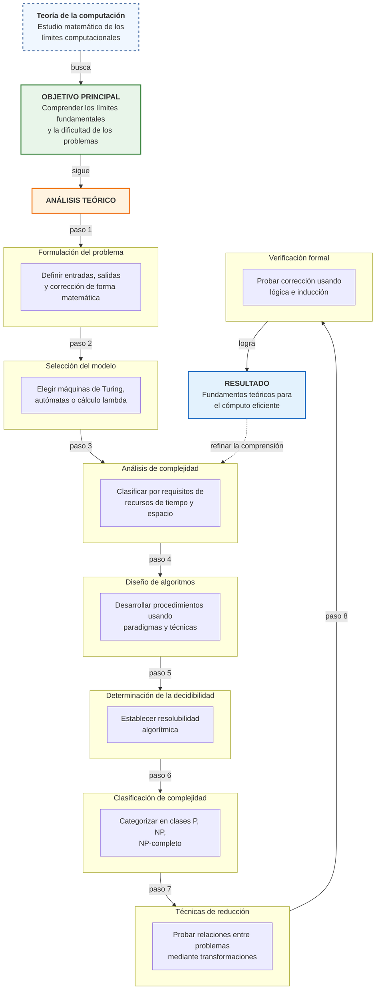

```mermaid
flowchart TD
    A[<b>Teoría de la computación</b><br>Estudio matemático de los<br>límites computacionales]:::title
    B[<b>OBJETIVO PRINCIPAL</b><br>Comprender los límites fundamentales<br>y la dificultad de los problemas]:::goal
    C[<b>ANÁLISIS TEÓRICO</b>]:::process
    
    subgraph D[Formulación del problema]
        D1[Definir entradas, salidas<br>y corrección de forma matemática]
    end
    
    subgraph E[Selección del modelo]
        E1[Elegir máquinas de Turing,<br>autómatas o cálculo lambda]
    end
    
    subgraph F[Análisis de complejidad]
        F1[Clasificar por requisitos de<br>recursos de tiempo y espacio]
    end
    
    subgraph G[Diseño de algoritmos]
        G1[Desarrollar procedimientos usando<br>paradigmas y técnicas]
    end
    
    subgraph H[Determinación de la decidibilidad]
        H1[Establecer resolubilidad<br>algorítmica]
    end
    
    subgraph I[Clasificación de complejidad]
        I1[Categorizar en clases P, NP,<br>NP-completo]
    end
    
    subgraph J[Técnicas de reducción]
        J1[Probar relaciones entre problemas<br>mediante transformaciones]
    end
    
    subgraph K[Verificación formal]
        K1[Probar corrección usando<br>lógica e inducción]
    end
    
    L[<b>RESULTADO</b><br>Fundamentos teóricos para<br>el cómputo eficiente]:::outcome
    
    A -->|busca| B
    B -->|sigue| C
    C -->|paso 1| D
    D -->|paso 2| E
    E -->|paso 3| F
    F -->|paso 4| G
    G -->|paso 5| H
    H -->|paso 6| I
    I -->|paso 7| J
    J -->|paso 8| K
    K -->|logra| L
    L -.->|refinar la comprensión| F
    
    classDef title fill:#f0f7ff,stroke:#4a6fa5,stroke-width:2px,color:#333,stroke-dasharray:5 5
    classDef goal fill:#e8f5e9,stroke:#2e7d32,stroke-width:2px,color:#333
    classDef process fill:#fff3e0,stroke:#ef6c00,stroke-width:2px,color:#333
    classDef outcome fill:#e3f2fd,stroke:#1565c0,stroke-width:2px,color:#333
```
