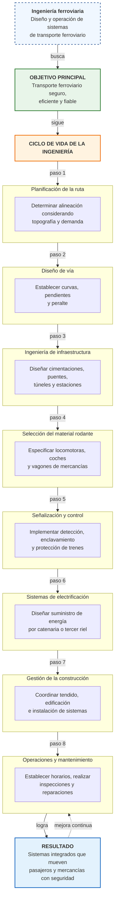

```mermaid
flowchart TD
    A[<b>Ingeniería ferroviaria</b><br>Diseño y operación de sistemas<br>de transporte ferroviario]:::title
    B[<b>OBJETIVO PRINCIPAL</b><br>Transporte ferroviario seguro,<br>eficiente y fiable]:::goal
    C[<b>CICLO DE VIDA DE LA INGENIERÍA</b>]:::process
    
    subgraph D[Planificación de la ruta]
        D1[Determinar alineación considerando<br>topografía y demanda]
    end
    
    subgraph E[Diseño de vía]
        E1[Establecer curvas, pendientes<br>y peralte]
    end
    
    subgraph F[Ingeniería de infraestructura]
        F1[Diseñar cimentaciones, puentes,<br>túneles y estaciones]
    end
    
    subgraph G[Selección del material rodante]
        G1[Especificar locomotoras, coches<br>y vagones de mercancías]
    end
    
    subgraph H[Señalización y control]
        H1[Implementar detección, enclavamiento<br>y protección de trenes]
    end
    
    subgraph I[Sistemas de electrificación]
        I1[Diseñar suministro de energía<br>por catenaria o tercer riel]
    end
    
    subgraph J[Gestión de la construcción]
        J1[Coordinar tendido, edificación<br>e instalación de sistemas]
    end
    
    subgraph K[Operaciones y mantenimiento]
        K1[Establecer horarios, realizar<br>inspecciones y reparaciones]
    end
    
    L[<b>RESULTADO</b><br>Sistemas integrados que mueven<br>pasajeros y mercancías con seguridad]:::outcome
    
    A -->|busca| B
    B -->|sigue| C
    C -->|paso 1| D
    D -->|paso 2| E
    E -->|paso 3| F
    F -->|paso 4| G
    G -->|paso 5| H
    H -->|paso 6| I
    I -->|paso 7| J
    J -->|paso 8| K
    K -->|logra| L
    L -.->|mejora continua| K
    
    classDef title fill:#f0f7ff,stroke:#4a6fa5,stroke-width:2px,color:#333,stroke-dasharray:5 5
    classDef goal fill:#e8f5e9,stroke:#2e7d32,stroke-width:2px,color:#333
    classDef process fill:#fff3e0,stroke:#ef6c00,stroke-width:2px,color:#333
    classDef outcome fill:#e3f2fd,stroke:#1565c0,stroke-width:2px,color:#333
```
