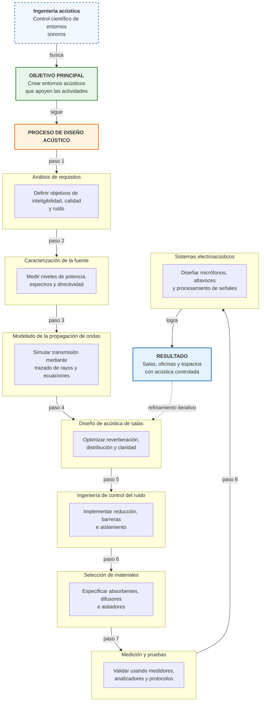

```mermaid
flowchart TD
    A[<b>Ingeniería acústica</b><br>Control científico de entornos<br>sonoros]:::title
    B[<b>OBJETIVO PRINCIPAL</b><br>Crear entornos acústicos<br>que apoyen las actividades]:::goal
    C[<b>PROCESO DE DISEÑO ACÚSTICO</b>]:::process
    
    subgraph D[Análisis de requisitos]
        D1[Definir objetivos de inteligibilidad, calidad<br>y ruido]
    end
    
    subgraph E[Caracterización de la fuente]
        E1[Medir niveles de potencia,<br>espectros y directividad]
    end
    
    subgraph F[Modelado de la propagación de ondas]
        F1[Simular transmisión mediante<br>trazado de rayos y ecuaciones]
    end
    
    subgraph G[Diseño de acústica de salas]
        G1[Optimizar reverberación,<br>distribución y claridad]
    end
    
    subgraph H[Ingeniería de control del ruido]
        H1[Implementar reducción, barreras<br>e aislamiento]
    end
    
    subgraph I[Selección de materiales]
        I1[Especificar absorbentes, difusores<br>e aisladores]
    end
    
    subgraph J[Medición y pruebas]
        J1[Validar usando medidores,<br>analizadores y protocolos]
    end
    
    subgraph K[Sistemas electroacústicos]
        K1[Diseñar micrófonos, altavoces<br>y procesamiento de señales]
    end
    
    L[<b>RESULTADO</b><br>Salas, oficinas y espacios<br>con acústica controlada]:::outcome
    
    A -->|busca| B
    B -->|sigue| C
    C -->|paso 1| D
    D -->|paso 2| E
    E -->|paso 3| F
    F -->|paso 4| G
    G -->|paso 5| H
    H -->|paso 6| I
    I -->|paso 7| J
    J -->|paso 8| K
    K -->|logra| L
    L -.->|refinamiento iterativo| G
    
    classDef title fill:#f0f7ff,stroke:#4a6fa5,stroke-width:2px,color:#333,stroke-dasharray:5 5
    classDef goal fill:#e8f5e9,stroke:#2e7d32,stroke-width:2px,color:#333
    classDef process fill:#fff3e0,stroke:#ef6c00,stroke-width:2px,color:#333
    classDef outcome fill:#e3f2fd,stroke:#1565c0,stroke-width:2px,color:#333
```
