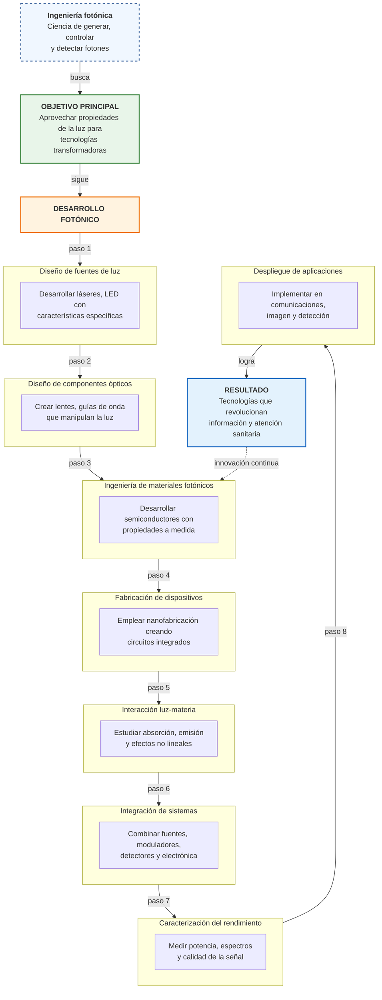

```mermaid
flowchart TD
    A[<b>Ingeniería fotónica</b><br>Ciencia de generar, controlar<br>y detectar fotones]:::title
    B[<b>OBJETIVO PRINCIPAL</b><br>Aprovechar propiedades de la luz para<br>tecnologías transformadoras]:::goal
    C[<b>DESARROLLO FOTÓNICO</b>]:::process
    
    subgraph D[Diseño de fuentes de luz]
        D1[Desarrollar láseres, LED con<br>características específicas]
    end
    
    subgraph E[Diseño de componentes ópticos]
        E1[Crear lentes, guías de onda<br>que manipulan la luz]
    end
    
    subgraph F[Ingeniería de materiales fotónicos]
        F1[Desarrollar semiconductores con<br>propiedades a medida]
    end
    
    subgraph G[Fabricación de dispositivos]
        G1[Emplear nanofabricación creando<br>circuitos integrados]
    end
    
    subgraph H[Interacción luz-materia]
        H1[Estudiar absorción, emisión<br>y efectos no lineales]
    end
    
    subgraph I[Integración de sistemas]
        I1[Combinar fuentes, moduladores,<br>detectores y electrónica]
    end
    
    subgraph J[Caracterización del rendimiento]
        J1[Medir potencia, espectros<br>y calidad de la señal]
    end
    
    subgraph K[Despliegue de aplicaciones]
        K1[Implementar en comunicaciones,<br>imagen y detección]
    end
    
    L[<b>RESULTADO</b><br>Tecnologías que revolucionan<br>información y atención sanitaria]:::outcome
    
    A -->|busca| B
    B -->|sigue| C
    C -->|paso 1| D
    D -->|paso 2| E
    E -->|paso 3| F
    F -->|paso 4| G
    G -->|paso 5| H
    H -->|paso 6| I
    I -->|paso 7| J
    J -->|paso 8| K
    K -->|logra| L
    L -.->|innovación continua| F
    
    classDef title fill:#f0f7ff,stroke:#4a6fa5,stroke-width:2px,color:#333,stroke-dasharray:5 5
    classDef goal fill:#e8f5e9,stroke:#2e7d32,stroke-width:2px,color:#333
    classDef process fill:#fff3e0,stroke:#ef6c00,stroke-width:2px,color:#333
    classDef outcome fill:#e3f2fd,stroke:#1565c0,stroke-width:2px,color:#333
```
