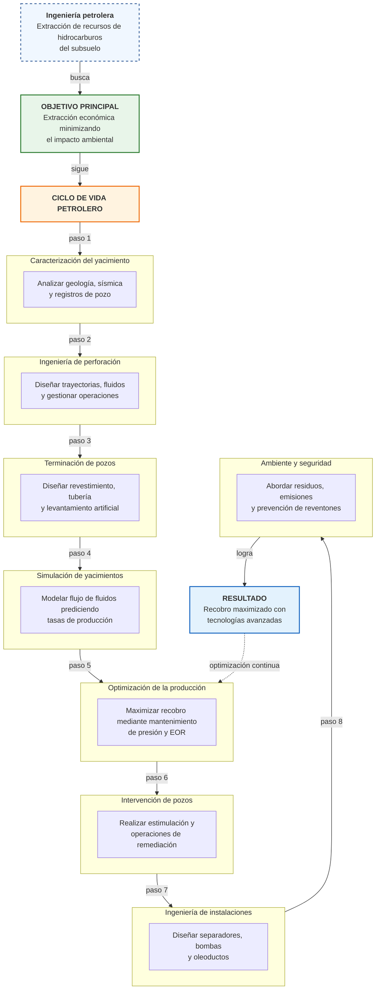

```mermaid
flowchart TD
    A[<b>Ingeniería petrolera</b><br>Extracción de recursos de hidrocarburos<br>del subsuelo]:::title
    B[<b>OBJETIVO PRINCIPAL</b><br>Extracción económica minimizando<br>el impacto ambiental]:::goal
    C[<b>CICLO DE VIDA PETROLERO</b>]:::process
    
    subgraph D[Caracterización del yacimiento]
        D1[Analizar geología, sísmica<br>y registros de pozo]
    end
    
    subgraph E[Ingeniería de perforación]
        E1[Diseñar trayectorias, fluidos<br>y gestionar operaciones]
    end
    
    subgraph F[Terminación de pozos]
        F1[Diseñar revestimiento, tubería<br>y levantamiento artificial]
    end
    
    subgraph G[Simulación de yacimientos]
        G1[Modelar flujo de fluidos prediciendo<br>tasas de producción]
    end
    
    subgraph H[Optimización de la producción]
        H1[Maximizar recobro mediante mantenimiento<br>de presión y EOR]
    end
    
    subgraph I[Intervención de pozos]
        I1[Realizar estimulación y<br>operaciones de remediación]
    end
    
    subgraph J[Ingeniería de instalaciones]
        J1[Diseñar separadores, bombas<br>y oleoductos]
    end
    
    subgraph K[Ambiente y seguridad]
        K1[Abordar residuos, emisiones<br>y prevención de reventones]
    end
    
    L[<b>RESULTADO</b><br>Recobro maximizado con<br>tecnologías avanzadas]:::outcome
    
    A -->|busca| B
    B -->|sigue| C
    C -->|paso 1| D
    D -->|paso 2| E
    E -->|paso 3| F
    F -->|paso 4| G
    G -->|paso 5| H
    H -->|paso 6| I
    I -->|paso 7| J
    J -->|paso 8| K
    K -->|logra| L
    L -.->|optimización continua| H
    
    classDef title fill:#f0f7ff,stroke:#4a6fa5,stroke-width:2px,color:#333,stroke-dasharray:5 5
    classDef goal fill:#e8f5e9,stroke:#2e7d32,stroke-width:2px,color:#333
    classDef process fill:#fff3e0,stroke:#ef6c00,stroke-width:2px,color:#333
    classDef outcome fill:#e3f2fd,stroke:#1565c0,stroke-width:2px,color:#333
```
