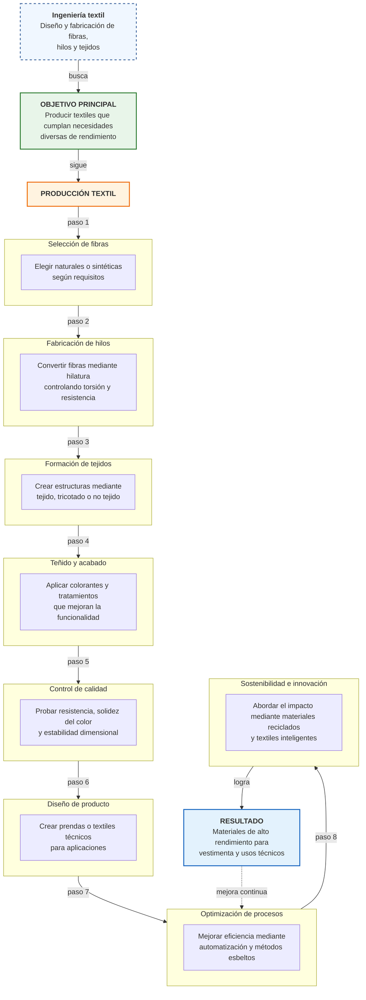

```mermaid
flowchart TD
    A[<b>Ingeniería textil</b><br>Diseño y fabricación de fibras,<br>hilos y tejidos]:::title
    B[<b>OBJETIVO PRINCIPAL</b><br>Producir textiles que cumplan necesidades<br>diversas de rendimiento]:::goal
    C[<b>PRODUCCIÓN TEXTIL</b>]:::process
    
    subgraph D[Selección de fibras]
        D1[Elegir naturales o sintéticas<br>según requisitos]
    end
    
    subgraph E[Fabricación de hilos]
        E1[Convertir fibras mediante hilatura<br>controlando torsión y resistencia]
    end
    
    subgraph F[Formación de tejidos]
        F1[Crear estructuras mediante<br>tejido, tricotado o no tejido]
    end
    
    subgraph G[Teñido y acabado]
        G1[Aplicar colorantes y tratamientos<br>que mejoran la funcionalidad]
    end
    
    subgraph H[Control de calidad]
        H1[Probar resistencia, solidez del color<br>y estabilidad dimensional]
    end
    
    subgraph I[Diseño de producto]
        I1[Crear prendas o textiles técnicos<br>para aplicaciones]
    end
    
    subgraph J[Optimización de procesos]
        J1[Mejorar eficiencia mediante<br>automatización y métodos esbeltos]
    end
    
    subgraph K[Sostenibilidad e innovación]
        K1[Abordar el impacto mediante materiales reciclados<br>y textiles inteligentes]
    end
    
    L[<b>RESULTADO</b><br>Materiales de alto rendimiento para<br>vestimenta y usos técnicos]:::outcome
    
    A -->|busca| B
    B -->|sigue| C
    C -->|paso 1| D
    D -->|paso 2| E
    E -->|paso 3| F
    F -->|paso 4| G
    G -->|paso 5| H
    H -->|paso 6| I
    I -->|paso 7| J
    J -->|paso 8| K
    K -->|logra| L
    L -.->|mejora continua| J
    
    classDef title fill:#f0f7ff,stroke:#4a6fa5,stroke-width:2px,color:#333,stroke-dasharray:5 5
    classDef goal fill:#e8f5e9,stroke:#2e7d32,stroke-width:2px,color:#333
    classDef process fill:#fff3e0,stroke:#ef6c00,stroke-width:2px,color:#333
    classDef outcome fill:#e3f2fd,stroke:#1565c0,stroke-width:2px,color:#333
```
