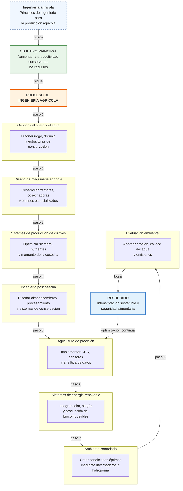

```mermaid
flowchart TD
    A[<b>Ingeniería agrícola</b><br>Principios de ingeniería para<br>la producción agrícola]:::title
    B[<b>OBJETIVO PRINCIPAL</b><br>Aumentar la productividad conservando<br>los recursos]:::goal
    C[<b>PROCESO DE INGENIERÍA AGRÍCOLA</b>]:::process
    
    subgraph D[Gestión del suelo y el agua]
        D1[Diseñar riego, drenaje<br>y estructuras de conservación]
    end
    
    subgraph E[Diseño de maquinaria agrícola]
        E1[Desarrollar tractores, cosechadoras<br>y equipos especializados]
    end
    
    subgraph F[Sistemas de producción de cultivos]
        F1[Optimizar siembra, nutrientes<br>y momento de la cosecha]
    end
    
    subgraph G[Ingeniería poscosecha]
        G1[Diseñar almacenamiento, procesamiento<br>y sistemas de conservación]
    end
    
    subgraph H[Agricultura de precisión]
        H1[Implementar GPS, sensores<br>y analítica de datos]
    end
    
    subgraph I[Sistemas de energía renovable]
        I1[Integrar solar, biogás<br>y producción de biocombustibles]
    end
    
    subgraph J[Ambiente controlado]
        J1[Crear condiciones óptimas<br>mediante invernaderos e hidroponía]
    end
    
    subgraph K[Evaluación ambiental]
        K1[Abordar erosión, calidad del agua<br>y emisiones]
    end
    
    L[<b>RESULTADO</b><br>Intensificación sostenible y<br>seguridad alimentaria]:::outcome
    
    A -->|busca| B
    B -->|sigue| C
    C -->|paso 1| D
    D -->|paso 2| E
    E -->|paso 3| F
    F -->|paso 4| G
    G -->|paso 5| H
    H -->|paso 6| I
    I -->|paso 7| J
    J -->|paso 8| K
    K -->|logra| L
    L -.->|optimización continua| H
    
    classDef title fill:#f0f7ff,stroke:#4a6fa5,stroke-width:2px,color:#333,stroke-dasharray:5 5
    classDef goal fill:#e8f5e9,stroke:#2e7d32,stroke-width:2px,color:#333
    classDef process fill:#fff3e0,stroke:#ef6c00,stroke-width:2px,color:#333
    classDef outcome fill:#e3f2fd,stroke:#1565c0,stroke-width:2px,color:#333
```
