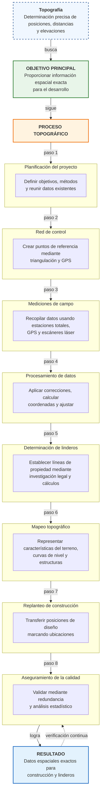

```mermaid
flowchart TD
    A[<b>Topografía</b><br>Determinación precisa de posiciones, distancias<br>y elevaciones]:::title
    B[<b>OBJETIVO PRINCIPAL</b><br>Proporcionar información espacial exacta<br>para el desarrollo]:::goal
    C[<b>PROCESO TOPOGRÁFICO</b>]:::process
    
    subgraph D[Planificación del proyecto]
        D1[Definir objetivos, métodos<br>y reunir datos existentes]
    end
    
    subgraph E[Red de control]
        E1[Crear puntos de referencia mediante<br>triangulación y GPS]
    end
    
    subgraph F[Mediciones de campo]
        F1[Recopilar datos usando estaciones totales,<br>GPS y escáneres láser]
    end
    
    subgraph G[Procesamiento de datos]
        G1[Aplicar correcciones, calcular<br>coordenadas y ajustar]
    end
    
    subgraph H[Determinación de linderos]
        H1[Establecer líneas de propiedad mediante<br>investigación legal y cálculos]
    end
    
    subgraph I[Mapeo topográfico]
        I1[Representar características del terreno,<br>curvas de nivel y estructuras]
    end
    
    subgraph J[Replanteo de construcción]
        J1[Transferir posiciones de diseño<br>marcando ubicaciones]
    end
    
    subgraph K[Aseguramiento de la calidad]
        K1[Validar mediante redundancia<br>y análisis estadístico]
    end
    
    L[<b>RESULTADO</b><br>Datos espaciales exactos para<br>construcción y linderos]:::outcome
    
    A -->|busca| B
    B -->|sigue| C
    C -->|paso 1| D
    D -->|paso 2| E
    E -->|paso 3| F
    F -->|paso 4| G
    G -->|paso 5| H
    H -->|paso 6| I
    I -->|paso 7| J
    J -->|paso 8| K
    K -->|logra| L
    L -.->|verificación continua| K
    
    classDef title fill:#f0f7ff,stroke:#4a6fa5,stroke-width:2px,color:#333,stroke-dasharray:5 5
    classDef goal fill:#e8f5e9,stroke:#2e7d32,stroke-width:2px,color:#333
    classDef process fill:#fff3e0,stroke:#ef6c00,stroke-width:2px,color:#333
    classDef outcome fill:#e3f2fd,stroke:#1565c0,stroke-width:2px,color:#333
```
