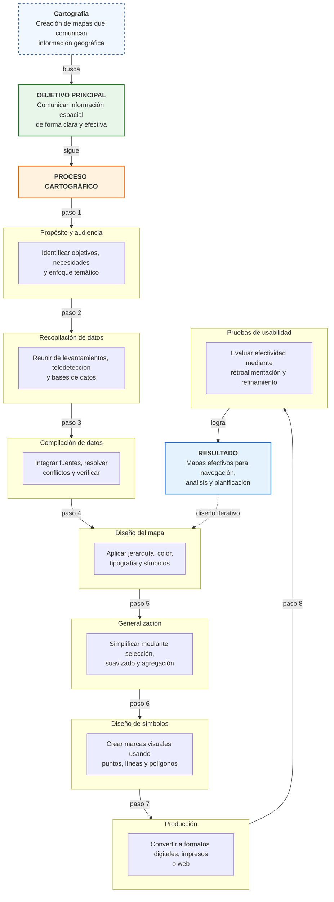

```mermaid
flowchart TD
    A[<b>Cartografía</b><br>Creación de mapas que comunican<br>información geográfica]:::title
    B[<b>OBJETIVO PRINCIPAL</b><br>Comunicar información espacial<br>de forma clara y efectiva]:::goal
    C[<b>PROCESO CARTOGRÁFICO</b>]:::process
    
    subgraph D[Propósito y audiencia]
        D1[Identificar objetivos, necesidades<br>y enfoque temático]
    end
    
    subgraph E[Recopilación de datos]
        E1[Reunir de levantamientos, teledetección<br>y bases de datos]
    end
    
    subgraph F[Compilación de datos]
        F1[Integrar fuentes, resolver<br>conflictos y verificar]
    end
    
    subgraph G[Diseño del mapa]
        G1[Aplicar jerarquía, color,<br>tipografía y símbolos]
    end
    
    subgraph H[Generalización]
        H1[Simplificar mediante selección,<br>suavizado y agregación]
    end
    
    subgraph I[Diseño de símbolos]
        I1[Crear marcas visuales usando<br>puntos, líneas y polígonos]
    end
    
    subgraph J[Producción]
        J1[Convertir a formatos digitales, impresos<br>o web]
    end
    
    subgraph K[Pruebas de usabilidad]
        K1[Evaluar efectividad mediante<br>retroalimentación y refinamiento]
    end
    
    L[<b>RESULTADO</b><br>Mapas efectivos para navegación,<br>análisis y planificación]:::outcome
    
    A -->|busca| B
    B -->|sigue| C
    C -->|paso 1| D
    D -->|paso 2| E
    E -->|paso 3| F
    F -->|paso 4| G
    G -->|paso 5| H
    H -->|paso 6| I
    I -->|paso 7| J
    J -->|paso 8| K
    K -->|logra| L
    L -.->|diseño iterativo| G
    
    classDef title fill:#f0f7ff,stroke:#4a6fa5,stroke-width:2px,color:#333,stroke-dasharray:5 5
    classDef goal fill:#e8f5e9,stroke:#2e7d32,stroke-width:2px,color:#333
    classDef process fill:#fff3e0,stroke:#ef6c00,stroke-width:2px,color:#333
    classDef outcome fill:#e3f2fd,stroke:#1565c0,stroke-width:2px,color:#333
```
