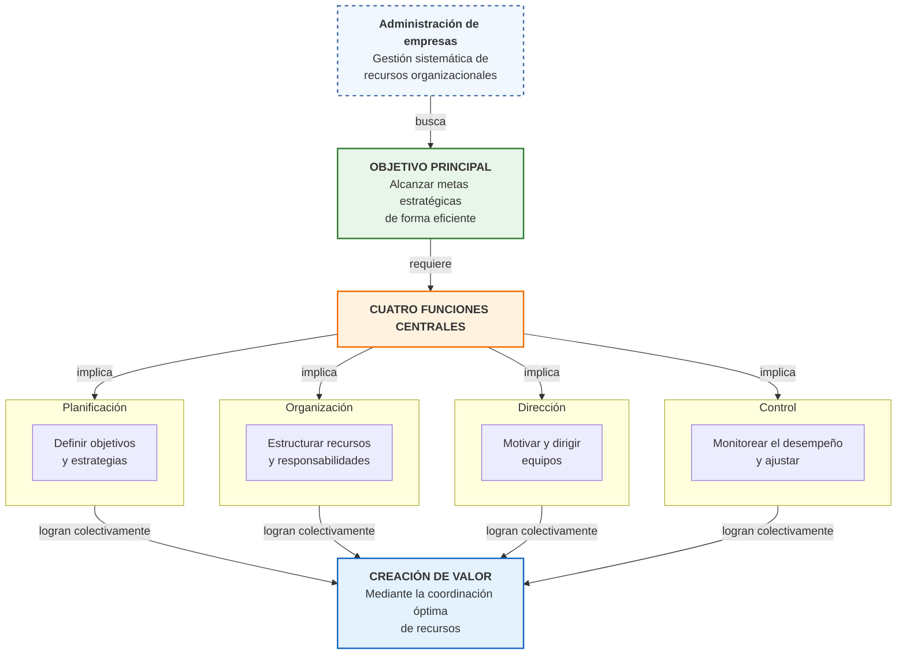

```mermaid
flowchart TD
    A[<b>Administración de empresas</b><br>Gestión sistemática de<br>recursos organizacionales]:::title
    B[<b>OBJETIVO PRINCIPAL</b><br>Alcanzar metas estratégicas<br>de forma eficiente]:::objective
    C[<b>CUATRO FUNCIONES CENTRALES</b>]:::functions
    
    subgraph D[Planificación]
        D1[Definir objetivos<br>y estrategias]
    end
    
    subgraph E[Organización]
        E1[Estructurar recursos<br>y responsabilidades]
    end
    
    subgraph F[Dirección]
        F1[Motivar y dirigir<br>equipos]
    end
    
    subgraph G[Control]
        G1[Monitorear el desempeño<br>y ajustar]
    end
    
    H[<b>CREACIÓN DE VALOR</b><br>Mediante la coordinación óptima<br>de recursos]:::value
    
    A -->|busca| B
    B -->|requiere| C
    C -->|implica| D
    C -->|implica| E
    C -->|implica| F
    C -->|implica| G
    D & E & F & G -->|logran colectivamente| H
    
    classDef title fill:#f0f7ff,stroke:#4a6fa5,stroke-width:2px,color:#333,stroke-dasharray:5 5
    classDef objective fill:#e8f5e9,stroke:#2e7d32,stroke-width:2px,color:#333
    classDef functions fill:#fff3e0,stroke:#ef6c00,stroke-width:2px,color:#333
    classDef value fill:#e3f2fd,stroke:#1565c0,stroke-width:2px,color:#333
```
