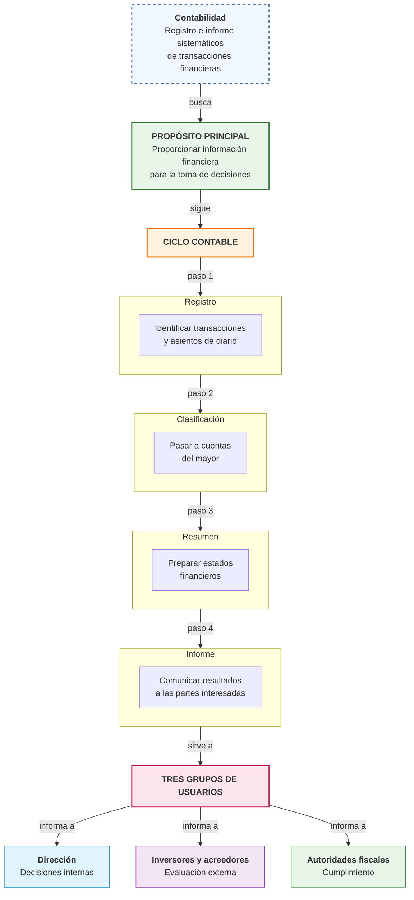

```mermaid
flowchart TD
    A[<b>Contabilidad</b><br>Registro e informe sistemáticos<br>de transacciones financieras]:::title
    B[<b>PROPÓSITO PRINCIPAL</b><br>Proporcionar información financiera<br>para la toma de decisiones]:::objective
    C[<b>CICLO CONTABLE</b>]:::cycle
    
    subgraph D[Registro]
        D1[Identificar transacciones<br>y asientos de diario]
    end
    
    subgraph E[Clasificación]
        E1[Pasar a cuentas<br>del mayor]
    end
    
    subgraph F[Resumen]
        F1[Preparar estados<br>financieros]
    end
    
    subgraph G[Informe]
        G1[Comunicar resultados<br>a las partes interesadas]
    end
    
    H[<b>TRES GRUPOS DE USUARIOS</b>]:::users
    
    I[<b>Dirección</b><br>Decisiones internas]:::internal
    J[<b>Inversores y acreedores</b><br>Evaluación externa]:::external
    K[<b>Autoridades fiscales</b><br>Cumplimiento]:::tax
    
    A -->|busca| B
    B -->|sigue| C
    C -->|paso 1| D
    D -->|paso 2| E
    E -->|paso 3| F
    F -->|paso 4| G
    G -->|sirve a| H
    H -->|informa a| I
    H -->|informa a| J
    H -->|informa a| K
    
    classDef title fill:#f0f7ff,stroke:#4a6fa5,stroke-width:2px,color:#333,stroke-dasharray:5 5
    classDef objective fill:#e8f5e9,stroke:#2e7d32,stroke-width:2px,color:#333
    classDef cycle fill:#fff3e0,stroke:#ef6c00,stroke-width:2px,color:#333
    classDef users fill:#fce4ec,stroke:#c2185b,stroke-width:2px,color:#333
    classDef internal fill:#e1f5fe,stroke:#0277bd,stroke-width:1px,color:#333
    classDef external fill:#f3e5f5,stroke:#7b1fa2,stroke-width:1px,color:#333
    classDef tax fill:#e8f5e9,stroke:#388e3c,stroke-width:1px,color:#333
```
