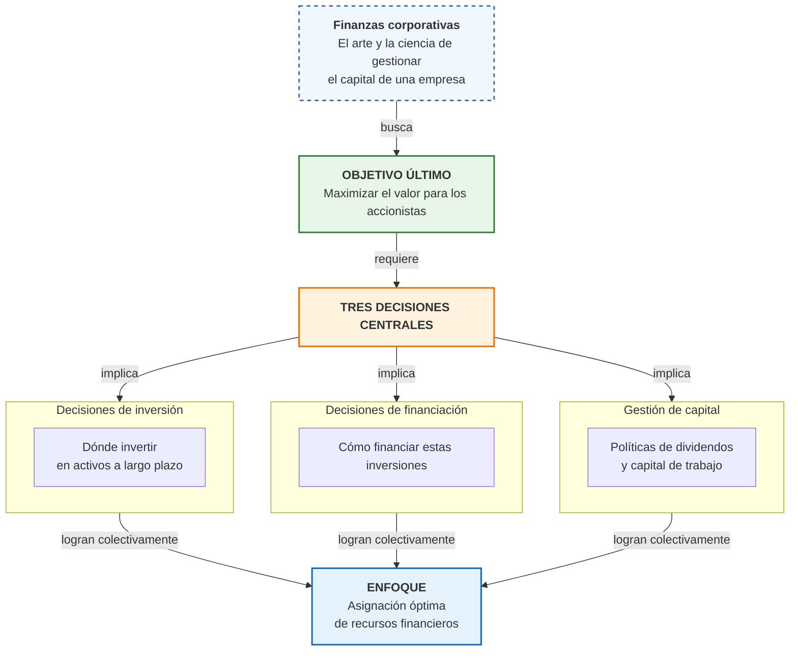

```mermaid
flowchart TD
    A[<b>Finanzas corporativas</b><br>El arte y la ciencia de gestionar<br>el capital de una empresa]:::title
    B[<b>OBJETIVO ÚLTIMO</b><br>Maximizar el valor para los accionistas]:::goal
    C[<b>TRES DECISIONES CENTRALES</b>]:::decisions
    
    subgraph D[Decisiones de inversión]
        D1[Dónde invertir<br>en activos a largo plazo]
    end
    
    subgraph E[Decisiones de financiación]
        E1[Cómo financiar estas inversiones]
    end
    
    subgraph F[Gestión de capital]
        F1[Políticas de dividendos<br>y capital de trabajo]
    end
    
    G[<b>ENFOQUE</b><br>Asignación óptima<br>de recursos financieros]:::focus
    
    A -->|busca| B
    B -->|requiere| C
    C -->|implica| D
    C -->|implica| E
    C -->|implica| F
    D & E & F -->|logran colectivamente| G
    
    classDef title fill:#f0f7ff,stroke:#4a6fa5,stroke-width:2px,color:#333,stroke-dasharray:5 5
    classDef goal fill:#e8f5e9,stroke:#2e7d32,stroke-width:2px,color:#333
    classDef decisions fill:#fff3e0,stroke:#ef6c00,stroke-width:2px,color:#333
    classDef focus fill:#e3f2fd,stroke:#1565c0,stroke-width:2px,color:#333
```
