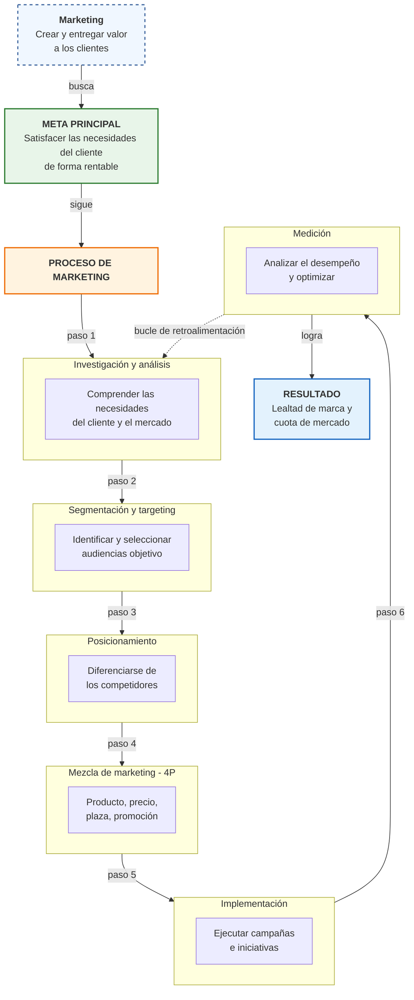

```mermaid
flowchart TD
    A[<b>Marketing</b><br>Crear y entregar valor<br>a los clientes]:::title
    B[<b>META PRINCIPAL</b><br>Satisfacer las necesidades del cliente<br>de forma rentable]:::goal
    C[<b>PROCESO DE MARKETING</b>]:::process
    
    subgraph D[Investigación y análisis]
        D1[Comprender las necesidades<br>del cliente y el mercado]
    end
    
    subgraph E[Segmentación y targeting]
        E1[Identificar y seleccionar<br>audiencias objetivo]
    end
    
    subgraph F[Posicionamiento]
        F1[Diferenciarse de<br>los competidores]
    end
    
    subgraph G[Mezcla de marketing - 4P]
        G1[Producto, precio,<br>plaza, promoción]
    end
    
    subgraph H[Implementación]
        H1[Ejecutar campañas<br>e iniciativas]
    end
    
    subgraph I[Medición]
        I1[Analizar el desempeño<br>y optimizar]
    end
    
    J[<b>RESULTADO</b><br>Lealtad de marca y<br>cuota de mercado]:::outcome
    
    A -->|busca| B
    B -->|sigue| C
    C -->|paso 1| D
    D -->|paso 2| E
    E -->|paso 3| F
    F -->|paso 4| G
    G -->|paso 5| H
    H -->|paso 6| I
    I -->|logra| J
    I -.->|bucle de retroalimentación| D
    
    classDef title fill:#f0f7ff,stroke:#4a6fa5,stroke-width:2px,color:#333,stroke-dasharray:5 5
    classDef goal fill:#e8f5e9,stroke:#2e7d32,stroke-width:2px,color:#333
    classDef process fill:#fff3e0,stroke:#ef6c00,stroke-width:2px,color:#333
    classDef outcome fill:#e3f2fd,stroke:#1565c0,stroke-width:2px,color:#333
```
