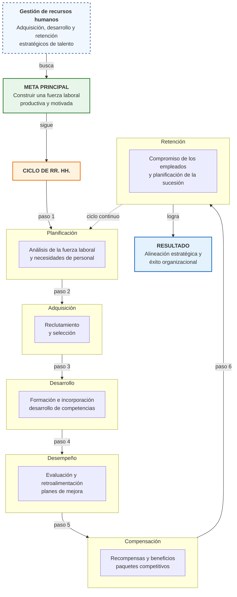

```mermaid
flowchart TD
    A[<b>Gestión de recursos humanos</b><br>Adquisición, desarrollo y retención<br>estratégicos de talento]:::title
    B[<b>META PRINCIPAL</b><br>Construir una fuerza laboral<br>productiva y motivada]:::goal
    C[<b>CICLO DE RR. HH.</b>]:::cycle
    
    subgraph D[Planificación]
        D1[Análisis de la fuerza laboral<br>y necesidades de personal]
    end
    
    subgraph E[Adquisición]
        E1[Reclutamiento<br>y selección]
    end
    
    subgraph F[Desarrollo]
        F1[Formación e incorporación<br>desarrollo de competencias]
    end
    
    subgraph G[Desempeño]
        G1[Evaluación y retroalimentación<br>planes de mejora]
    end
    
    subgraph H[Compensación]
        H1[Recompensas y beneficios<br>paquetes competitivos]
    end
    
    subgraph I[Retención]
        I1[Compromiso de los empleados<br>y planificación de la sucesión]
    end
    
    J[<b>RESULTADO</b><br>Alineación estratégica y<br>éxito organizacional]:::outcome
    
    A -->|busca| B
    B -->|sigue| C
    C -->|paso 1| D
    D -->|paso 2| E
    E -->|paso 3| F
    F -->|paso 4| G
    G -->|paso 5| H
    H -->|paso 6| I
    I -->|logra| J
    I -.->|ciclo continuo| D
    
    classDef title fill:#f0f7ff,stroke:#4a6fa5,stroke-width:2px,color:#333,stroke-dasharray:5 5
    classDef goal fill:#e8f5e9,stroke:#2e7d32,stroke-width:2px,color:#333
    classDef cycle fill:#fff3e0,stroke:#ef6c00,stroke-width:2px,color:#333
    classDef outcome fill:#e3f2fd,stroke:#1565c0,stroke-width:2px,color:#333
```
