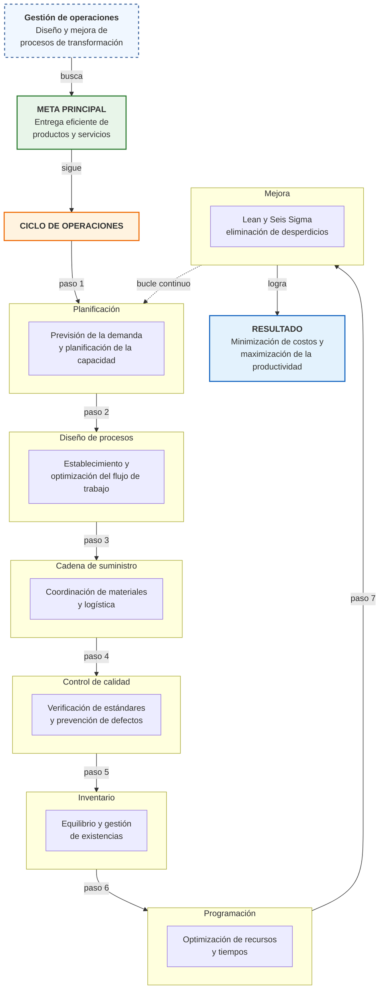

```mermaid
flowchart TD
    A[<b>Gestión de operaciones</b><br>Diseño y mejora de<br>procesos de transformación]:::title
    B[<b>META PRINCIPAL</b><br>Entrega eficiente de<br>productos y servicios]:::goal
    C[<b>CICLO DE OPERACIONES</b>]:::cycle
    
    subgraph D[Planificación]
        D1[Previsión de la demanda<br>y planificación de la capacidad]
    end
    
    subgraph E[Diseño de procesos]
        E1[Establecimiento y<br>optimización del flujo de trabajo]
    end
    
    subgraph F[Cadena de suministro]
        F1[Coordinación de materiales<br>y logística]
    end
    
    subgraph G[Control de calidad]
        G1[Verificación de estándares<br>y prevención de defectos]
    end
    
    subgraph H[Inventario]
        H1[Equilibrio y gestión<br>de existencias]
    end
    
    subgraph I[Programación]
        I1[Optimización de recursos<br>y tiempos]
    end
    
    subgraph J[Mejora]
        J1[Lean y Seis Sigma<br>eliminación de desperdicios]
    end
    
    K[<b>RESULTADO</b><br>Minimización de costos y<br>maximización de la productividad]:::outcome
    
    A -->|busca| B
    B -->|sigue| C
    C -->|paso 1| D
    D -->|paso 2| E
    E -->|paso 3| F
    F -->|paso 4| G
    G -->|paso 5| H
    H -->|paso 6| I
    I -->|paso 7| J
    J -->|logra| K
    J -.->|bucle continuo| D
    
    classDef title fill:#f0f7ff,stroke:#4a6fa5,stroke-width:2px,color:#333,stroke-dasharray:5 5
    classDef goal fill:#e8f5e9,stroke:#2e7d32,stroke-width:2px,color:#333
    classDef cycle fill:#fff3e0,stroke:#ef6c00,stroke-width:2px,color:#333
    classDef outcome fill:#e3f2fd,stroke:#1565c0,stroke-width:2px,color:#333
```
