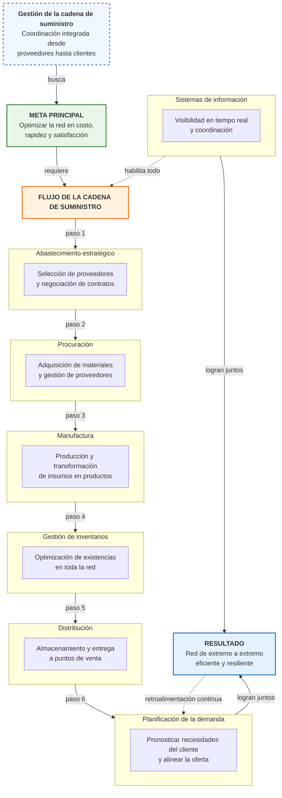

```mermaid
flowchart TD
    A[<b>Gestión de la cadena de suministro</b><br>Coordinación integrada desde<br>proveedores hasta clientes]:::title
    B[<b>META PRINCIPAL</b><br>Optimizar la red en costo,<br>rapidez y satisfacción]:::goal
    C[<b>FLUJO DE LA CADENA DE SUMINISTRO</b>]:::flow
    
    subgraph D[Abastecimiento estratégico]
        D1[Selección de proveedores<br>y negociación de contratos]
    end
    
    subgraph E[Procuración]
        E1[Adquisición de materiales<br>y gestión de proveedores]
    end
    
    subgraph F[Manufactura]
        F1[Producción y transformación<br>de insumos en productos]
    end
    
    subgraph G[Gestión de inventarios]
        G1[Optimización de existencias<br>en toda la red]
    end
    
    subgraph H[Distribución]
        H1[Almacenamiento y entrega<br>a puntos de venta]
    end
    
    subgraph I[Planificación de la demanda]
        I1[Pronosticar necesidades del cliente<br>y alinear la oferta]
    end
    
    subgraph J[Sistemas de información]
        J1[Visibilidad en tiempo real<br>y coordinación]
    end
    
    K[<b>RESULTADO</b><br>Red de extremo a extremo<br>eficiente y resiliente]:::outcome
    
    A -->|busca| B
    B -->|requiere| C
    C -->|paso 1| D
    D -->|paso 2| E
    E -->|paso 3| F
    F -->|paso 4| G
    G -->|paso 5| H
    H -->|paso 6| I
    I & J -->|logran juntos| K
    J -.->|habilita todo| C
    K -.->|retroalimentación continua| I
    
    classDef title fill:#f0f7ff,stroke:#4a6fa5,stroke-width:2px,color:#333,stroke-dasharray:5 5
    classDef goal fill:#e8f5e9,stroke:#2e7d32,stroke-width:2px,color:#333
    classDef flow fill:#fff3e0,stroke:#ef6c00,stroke-width:2px,color:#333
    classDef outcome fill:#e3f2fd,stroke:#1565c0,stroke-width:2px,color:#333
```
