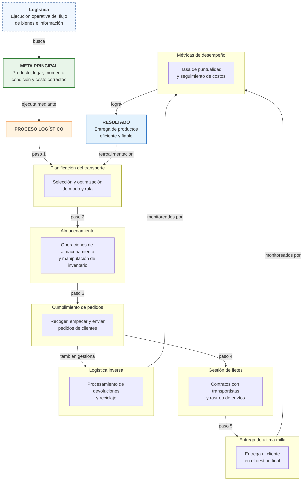

```mermaid
flowchart TD
    A[<b>Logística</b><br>Ejecución operativa del flujo<br>de bienes e información]:::title
    B[<b>META PRINCIPAL</b><br>Producto, lugar, momento,<br>condición y costo correctos]:::goal
    C[<b>PROCESO LOGÍSTICO</b>]:::process
    
    subgraph D[Planificación del transporte]
        D1[Selección y optimización<br>de modo y ruta]
    end
    
    subgraph E[Almacenamiento]
        E1[Operaciones de almacenamiento<br>y manipulación de inventario]
    end
    
    subgraph F[Cumplimiento de pedidos]
        F1[Recoger, empacar y enviar<br>pedidos de clientes]
    end
    
    subgraph G[Gestión de fletes]
        G1[Contratos con transportistas<br>y rastreo de envíos]
    end
    
    subgraph H[Logística inversa]
        H1[Procesamiento de devoluciones<br>y reciclaje]
    end
    
    subgraph I[Entrega de última milla]
        I1[Entrega al cliente<br>en el destino final]
    end
    
    subgraph J[Métricas de desempeño]
        J1[Tasa de puntualidad<br>y seguimiento de costos]
    end
    
    K[<b>RESULTADO</b><br>Entrega de productos<br>eficiente y fiable]:::outcome
    
    A -->|busca| B
    B -->|ejecuta mediante| C
    C -->|paso 1| D
    D -->|paso 2| E
    E -->|paso 3| F
    F -->|paso 4| G
    G -->|paso 5| I
    F -.->|también gestiona| H
    I & H -->|monitoreados por| J
    J -->|logra| K
    K -.->|retroalimentación| D
    
    classDef title fill:#f0f7ff,stroke:#4a6fa5,stroke-width:2px,color:#333,stroke-dasharray:5 5
    classDef goal fill:#e8f5e9,stroke:#2e7d32,stroke-width:2px,color:#333
    classDef process fill:#fff3e0,stroke:#ef6c00,stroke-width:2px,color:#333
    classDef outcome fill:#e3f2fd,stroke:#1565c0,stroke-width:2px,color:#333
```
