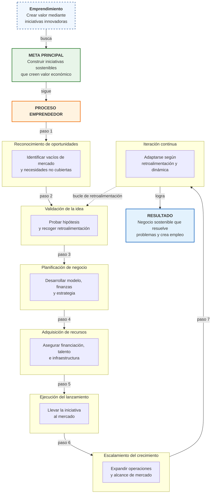

```mermaid
flowchart TD
    A[<b>Emprendimiento</b><br>Crear valor mediante<br>iniciativas innovadoras]:::title
    B[<b>META PRINCIPAL</b><br>Construir iniciativas sostenibles<br>que creen valor económico]:::goal
    C[<b>PROCESO EMPRENDEDOR</b>]:::process
    
    subgraph D[Reconocimiento de oportunidades]
        D1[Identificar vacíos de mercado<br>y necesidades no cubiertas]
    end
    
    subgraph E[Validación de la idea]
        E1[Probar hipótesis<br>y recoger retroalimentación]
    end
    
    subgraph F[Planificación de negocio]
        F1[Desarrollar modelo, finanzas<br>y estrategia]
    end
    
    subgraph G[Adquisición de recursos]
        G1[Asegurar financiación, talento<br>e infraestructura]
    end
    
    subgraph H[Ejecución del lanzamiento]
        H1[Llevar la iniciativa<br>al mercado]
    end
    
    subgraph I[Escalamiento del crecimiento]
        I1[Expandir operaciones<br>y alcance de mercado]
    end
    
    subgraph J[Iteración continua]
        J1[Adaptarse según<br>retroalimentación y dinámica]
    end
    
    K[<b>RESULTADO</b><br>Negocio sostenible que resuelve<br>problemas y crea empleo]:::outcome
    
    A -->|busca| B
    B -->|sigue| C
    C -->|paso 1| D
    D -->|paso 2| E
    E -->|paso 3| F
    F -->|paso 4| G
    G -->|paso 5| H
    H -->|paso 6| I
    I -->|paso 7| J
    J -->|logra| K
    J -.->|bucle de retroalimentación| E
    
    classDef title fill:#f0f7ff,stroke:#4a6fa5,stroke-width:2px,color:#333,stroke-dasharray:5 5
    classDef goal fill:#e8f5e9,stroke:#2e7d32,stroke-width:2px,color:#333
    classDef process fill:#fff3e0,stroke:#ef6c00,stroke-width:2px,color:#333
    classDef outcome fill:#e3f2fd,stroke:#1565c0,stroke-width:2px,color:#333
```
