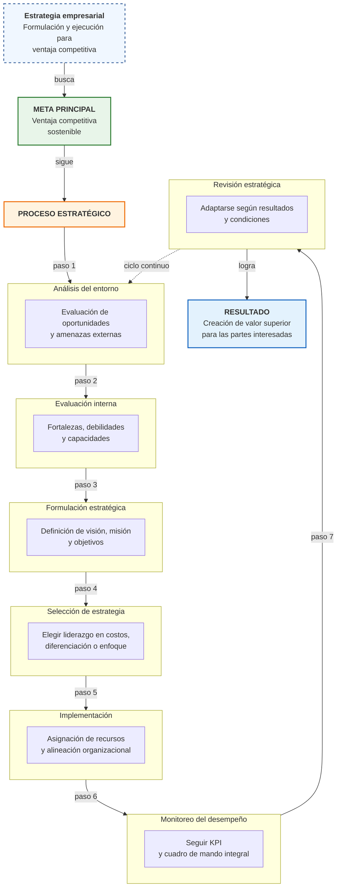

```mermaid
flowchart TD
    A[<b>Estrategia empresarial</b><br>Formulación y ejecución para<br>ventaja competitiva]:::title
    B[<b>META PRINCIPAL</b><br>Ventaja competitiva<br>sostenible]:::goal
    C[<b>PROCESO ESTRATÉGICO</b>]:::process
    
    subgraph D[Análisis del entorno]
        D1[Evaluación de oportunidades<br>y amenazas externas]
    end
    
    subgraph E[Evaluación interna]
        E1[Fortalezas, debilidades<br>y capacidades]
    end
    
    subgraph F[Formulación estratégica]
        F1[Definición de visión, misión<br>y objetivos]
    end
    
    subgraph G[Selección de estrategia]
        G1[Elegir liderazgo en costos,<br>diferenciación o enfoque]
    end
    
    subgraph H[Implementación]
        H1[Asignación de recursos<br>y alineación organizacional]
    end
    
    subgraph I[Monitoreo del desempeño]
        I1[Seguir KPI<br>y cuadro de mando integral]
    end
    
    subgraph J[Revisión estratégica]
        J1[Adaptarse según resultados<br>y condiciones]
    end
    
    K[<b>RESULTADO</b><br>Creación de valor superior<br>para las partes interesadas]:::outcome
    
    A -->|busca| B
    B -->|sigue| C
    C -->|paso 1| D
    D -->|paso 2| E
    E -->|paso 3| F
    F -->|paso 4| G
    G -->|paso 5| H
    H -->|paso 6| I
    I -->|paso 7| J
    J -->|logra| K
    J -.->|ciclo continuo| D
    
    classDef title fill:#f0f7ff,stroke:#4a6fa5,stroke-width:2px,color:#333,stroke-dasharray:5 5
    classDef goal fill:#e8f5e9,stroke:#2e7d32,stroke-width:2px,color:#333
    classDef process fill:#fff3e0,stroke:#ef6c00,stroke-width:2px,color:#333
    classDef outcome fill:#e3f2fd,stroke:#1565c0,stroke-width:2px,color:#333
```
