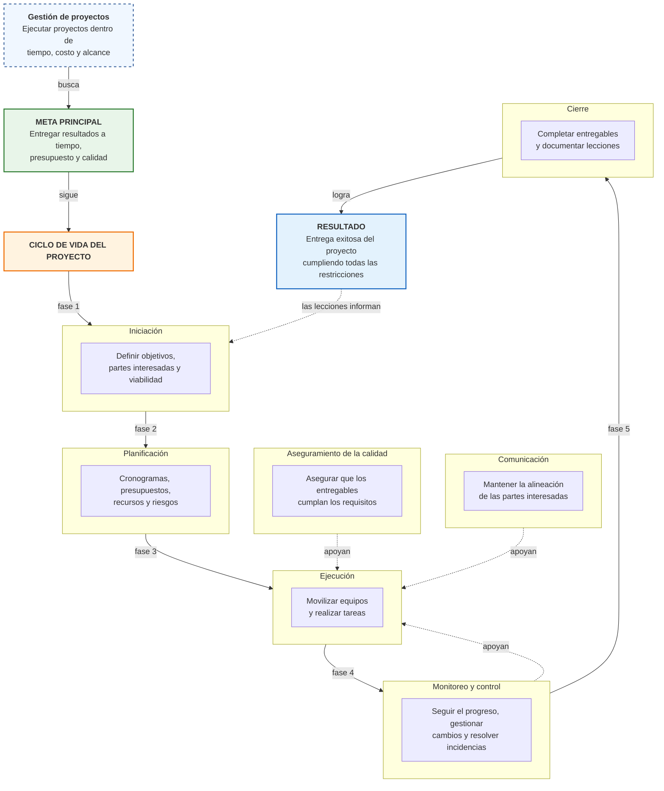

```mermaid
flowchart TD
    A[<b>Gestión de proyectos</b><br>Ejecutar proyectos dentro de<br>tiempo, costo y alcance]:::title
    B[<b>META PRINCIPAL</b><br>Entregar resultados a tiempo,<br>presupuesto y calidad]:::goal
    C[<b>CICLO DE VIDA DEL PROYECTO</b>]:::lifecycle
    
    subgraph D[Iniciación]
        D1[Definir objetivos,<br>partes interesadas y viabilidad]
    end
    
    subgraph E[Planificación]
        E1[Cronogramas, presupuestos,<br>recursos y riesgos]
    end
    
    subgraph F[Ejecución]
        F1[Movilizar equipos<br>y realizar tareas]
    end
    
    subgraph G[Monitoreo y control]
        G1[Seguir el progreso, gestionar<br>cambios y resolver incidencias]
    end
    
    subgraph H[Aseguramiento de la calidad]
        H1[Asegurar que los entregables<br>cumplan los requisitos]
    end
    
    subgraph I[Comunicación]
        I1[Mantener la alineación<br>de las partes interesadas]
    end
    
    subgraph J[Cierre]
        J1[Completar entregables<br>y documentar lecciones]
    end
    
    K[<b>RESULTADO</b><br>Entrega exitosa del proyecto<br>cumpliendo todas las restricciones]:::outcome
    
    A -->|busca| B
    B -->|sigue| C
    C -->|fase 1| D
    D -->|fase 2| E
    E -->|fase 3| F
    F -->|fase 4| G
    G & H & I -.->|apoyan| F
    G -->|fase 5| J
    J -->|logra| K
    K -.->|las lecciones informan| D
    
    classDef title fill:#f0f7ff,stroke:#4a6fa5,stroke-width:2px,color:#333,stroke-dasharray:5 5
    classDef goal fill:#e8f5e9,stroke:#2e7d32,stroke-width:2px,color:#333
    classDef lifecycle fill:#fff3e0,stroke:#ef6c00,stroke-width:2px,color:#333
    classDef outcome fill:#e3f2fd,stroke:#1565c0,stroke-width:2px,color:#333
```
