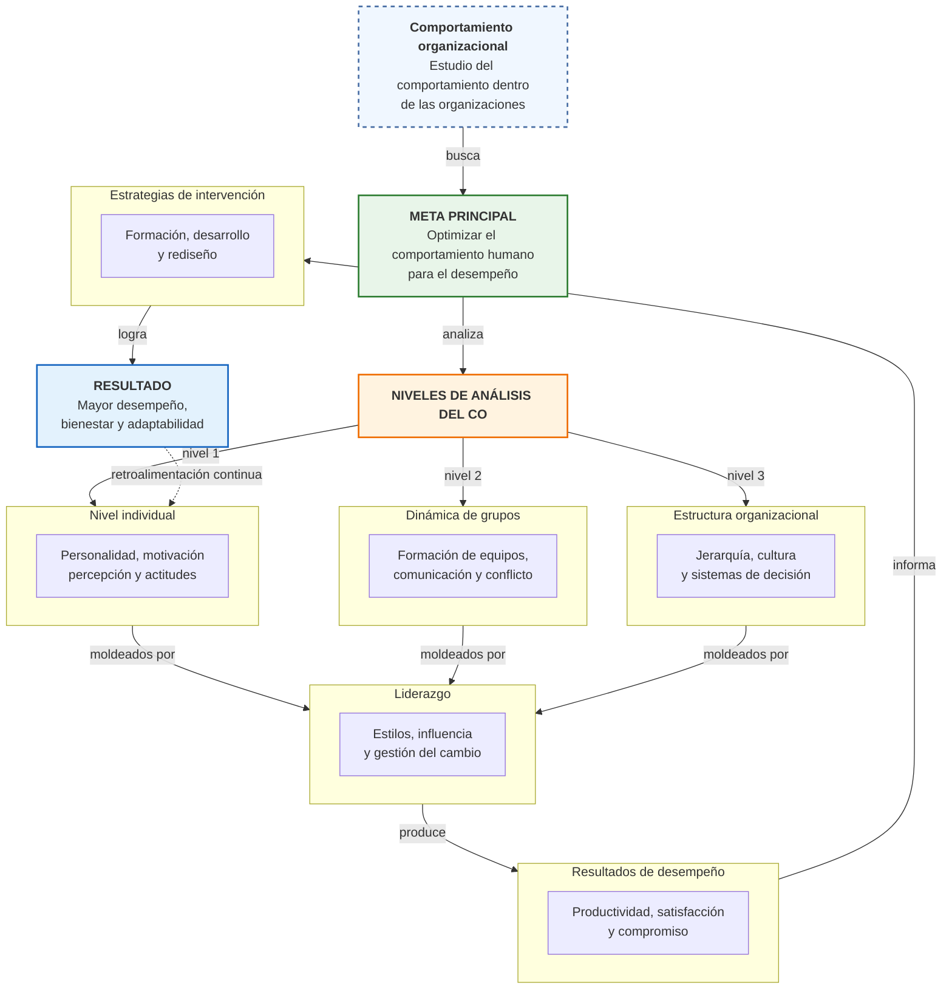

```mermaid
flowchart TD
    A[<b>Comportamiento organizacional</b><br>Estudio del comportamiento dentro<br>de las organizaciones]:::title
    B[<b>META PRINCIPAL</b><br>Optimizar el comportamiento humano<br>para el desempeño]:::goal
    C[<b>NIVELES DE ANÁLISIS DEL CO</b>]:::levels
    
    subgraph D[Nivel individual]
        D1[Personalidad, motivación<br>percepción y actitudes]
    end
    
    subgraph E[Dinámica de grupos]
        E1[Formación de equipos,<br>comunicación y conflicto]
    end
    
    subgraph F[Estructura organizacional]
        F1[Jerarquía, cultura<br>y sistemas de decisión]
    end
    
    subgraph G[Liderazgo]
        G1[Estilos, influencia<br>y gestión del cambio]
    end
    
    subgraph H[Resultados de desempeño]
        H1[Productividad, satisfacción<br>y compromiso]
    end
    
    subgraph I[Estrategias de intervención]
        I1[Formación, desarrollo<br>y rediseño]
    end
    
    J[<b>RESULTADO</b><br>Mayor desempeño,<br>bienestar y adaptabilidad]:::outcome
    
    A -->|busca| B
    B -->|analiza| C
    C -->|nivel 1| D
    C -->|nivel 2| E
    C -->|nivel 3| F
    D & E & F -->|moldeados por| G
    G -->|produce| H
    H -->|informa| I
    I -->|logra| J
    J -.->|retroalimentación continua| D
    
    classDef title fill:#f0f7ff,stroke:#4a6fa5,stroke-width:2px,color:#333,stroke-dasharray:5 5
    classDef goal fill:#e8f5e9,stroke:#2e7d32,stroke-width:2px,color:#333
    classDef levels fill:#fff3e0,stroke:#ef6c00,stroke-width:2px,color:#333
    classDef outcome fill:#e3f2fd,stroke:#1565c0,stroke-width:2px,color:#333
```
