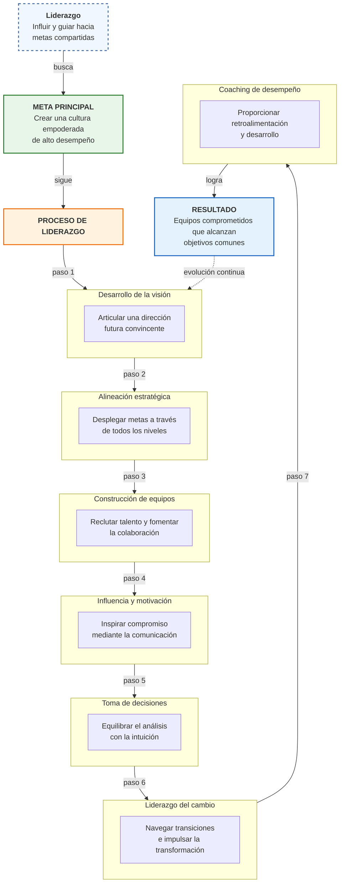

```mermaid
flowchart TD
    A[<b>Liderazgo</b><br>Influir y guiar hacia<br>metas compartidas]:::title
    B[<b>META PRINCIPAL</b><br>Crear una cultura empoderada<br>de alto desempeño]:::goal
    C[<b>PROCESO DE LIDERAZGO</b>]:::process
    
    subgraph D[Desarrollo de la visión]
        D1[Articular una dirección<br>futura convincente]
    end
    
    subgraph E[Alineación estratégica]
        E1[Desplegar metas a través<br>de todos los niveles]
    end
    
    subgraph F[Construcción de equipos]
        F1[Reclutar talento y fomentar<br>la colaboración]
    end
    
    subgraph G[Influencia y motivación]
        G1[Inspirar compromiso<br>mediante la comunicación]
    end
    
    subgraph H[Toma de decisiones]
        H1[Equilibrar el análisis<br>con la intuición]
    end
    
    subgraph I[Liderazgo del cambio]
        I1[Navegar transiciones<br>e impulsar la transformación]
    end
    
    subgraph J[Coaching de desempeño]
        J1[Proporcionar retroalimentación<br>y desarrollo]
    end
    
    K[<b>RESULTADO</b><br>Equipos comprometidos que alcanzan<br>objetivos comunes]:::outcome
    
    A -->|busca| B
    B -->|sigue| C
    C -->|paso 1| D
    D -->|paso 2| E
    E -->|paso 3| F
    F -->|paso 4| G
    G -->|paso 5| H
    H -->|paso 6| I
    I -->|paso 7| J
    J -->|logra| K
    K -.->|evolución continua| D
    
    classDef title fill:#f0f7ff,stroke:#4a6fa5,stroke-width:2px,color:#333,stroke-dasharray:5 5
    classDef goal fill:#e8f5e9,stroke:#2e7d32,stroke-width:2px,color:#333
    classDef process fill:#fff3e0,stroke:#ef6c00,stroke-width:2px,color:#333
    classDef outcome fill:#e3f2fd,stroke:#1565c0,stroke-width:2px,color:#333
```
