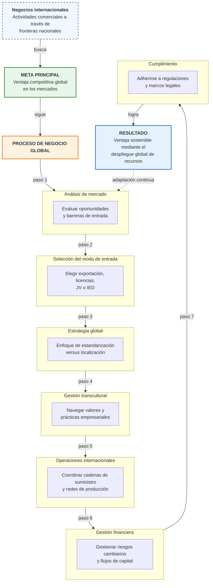

```mermaid
flowchart TD
    A[<b>Negocios internacionales</b><br>Actividades comerciales a través de<br>fronteras nacionales]:::title
    B[<b>META PRINCIPAL</b><br>Ventaja competitiva global<br>en los mercados]:::goal
    C[<b>PROCESO DE NEGOCIO GLOBAL</b>]:::process
    
    subgraph D[Análisis de mercado]
        D1[Evaluar oportunidades<br>y barreras de entrada]
    end
    
    subgraph E[Selección del modo de entrada]
        E1[Elegir exportación, licencias,<br>JV o IED]
    end
    
    subgraph F[Estrategia global]
        F1[Enfoque de estandarización<br>versus localización]
    end
    
    subgraph G[Gestión transcultural]
        G1[Navegar valores y<br>prácticas empresariales]
    end
    
    subgraph H[Operaciones internacionales]
        H1[Coordinar cadenas de suministro<br>y redes de producción]
    end
    
    subgraph I[Gestión financiera]
        I1[Gestionar riesgos cambiarios<br>y flujos de capital]
    end
    
    subgraph J[Cumplimiento]
        J1[Adherirse a regulaciones<br>y marcos legales]
    end
    
    K[<b>RESULTADO</b><br>Ventaja sostenible mediante el<br>despliegue global de recursos]:::outcome
    
    A -->|busca| B
    B -->|sigue| C
    C -->|paso 1| D
    D -->|paso 2| E
    E -->|paso 3| F
    F -->|paso 4| G
    G -->|paso 5| H
    H -->|paso 6| I
    I -->|paso 7| J
    J -->|logra| K
    K -.->|adaptación continua| D
    
    classDef title fill:#f0f7ff,stroke:#4a6fa5,stroke-width:2px,color:#333,stroke-dasharray:5 5
    classDef goal fill:#e8f5e9,stroke:#2e7d32,stroke-width:2px,color:#333
    classDef process fill:#fff3e0,stroke:#ef6c00,stroke-width:2px,color:#333
    classDef outcome fill:#e3f2fd,stroke:#1565c0,stroke-width:2px,color:#333
```
