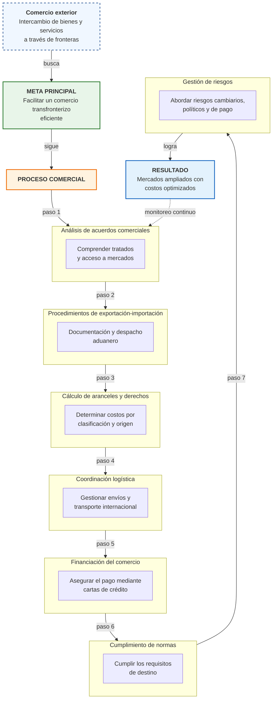

```mermaid
flowchart TD
    A[<b>Comercio exterior</b><br>Intercambio de bienes y servicios<br>a través de fronteras]:::title
    B[<b>META PRINCIPAL</b><br>Facilitar un comercio transfronterizo<br>eficiente]:::goal
    C[<b>PROCESO COMERCIAL</b>]:::process
    
    subgraph D[Análisis de acuerdos comerciales]
        D1[Comprender tratados<br>y acceso a mercados]
    end
    
    subgraph E[Procedimientos de exportación-importación]
        E1[Documentación y despacho<br>aduanero]
    end
    
    subgraph F[Cálculo de aranceles y derechos]
        F1[Determinar costos por<br>clasificación y origen]
    end
    
    subgraph G[Coordinación logística]
        G1[Gestionar envíos y<br>transporte internacional]
    end
    
    subgraph H[Financiación del comercio]
        H1[Asegurar el pago mediante<br>cartas de crédito]
    end
    
    subgraph I[Cumplimiento de normas]
        I1[Cumplir los requisitos<br>de destino]
    end
    
    subgraph J[Gestión de riesgos]
        J1[Abordar riesgos cambiarios,<br>políticos y de pago]
    end
    
    K[<b>RESULTADO</b><br>Mercados ampliados con<br>costos optimizados]:::outcome
    
    A -->|busca| B
    B -->|sigue| C
    C -->|paso 1| D
    D -->|paso 2| E
    E -->|paso 3| F
    F -->|paso 4| G
    G -->|paso 5| H
    H -->|paso 6| I
    I -->|paso 7| J
    J -->|logra| K
    K -.->|monitoreo continuo| D
    
    classDef title fill:#f0f7ff,stroke:#4a6fa5,stroke-width:2px,color:#333,stroke-dasharray:5 5
    classDef goal fill:#e8f5e9,stroke:#2e7d32,stroke-width:2px,color:#333
    classDef process fill:#fff3e0,stroke:#ef6c00,stroke-width:2px,color:#333
    classDef outcome fill:#e3f2fd,stroke:#1565c0,stroke-width:2px,color:#333
```
