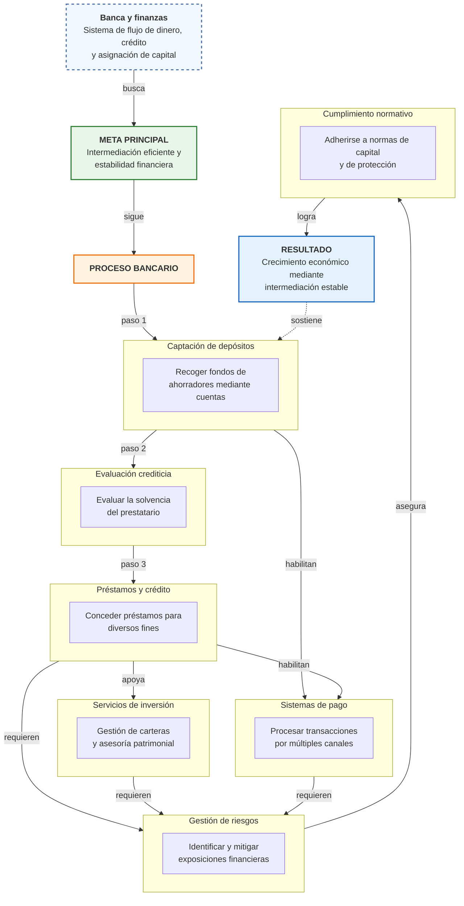

```mermaid
flowchart TD
    A[<b>Banca y finanzas</b><br>Sistema de flujo de dinero, crédito<br>y asignación de capital]:::title
    B[<b>META PRINCIPAL</b><br>Intermediación eficiente y<br>estabilidad financiera]:::goal
    C[<b>PROCESO BANCARIO</b>]:::process
    
    subgraph D[Captación de depósitos]
        D1[Recoger fondos de<br>ahorradores mediante cuentas]
    end
    
    subgraph E[Evaluación crediticia]
        E1[Evaluar la solvencia<br>del prestatario]
    end
    
    subgraph F[Préstamos y crédito]
        F1[Conceder préstamos para<br>diversos fines]
    end
    
    subgraph G[Servicios de inversión]
        G1[Gestión de carteras<br>y asesoría patrimonial]
    end
    
    subgraph H[Sistemas de pago]
        H1[Procesar transacciones<br>por múltiples canales]
    end
    
    subgraph I[Gestión de riesgos]
        I1[Identificar y mitigar<br>exposiciones financieras]
    end
    
    subgraph J[Cumplimiento normativo]
        J1[Adherirse a normas de capital<br>y de protección]
    end
    
    K[<b>RESULTADO</b><br>Crecimiento económico mediante<br>intermediación estable]:::outcome
    
    A -->|busca| B
    B -->|sigue| C
    C -->|paso 1| D
    D -->|paso 2| E
    E -->|paso 3| F
    F -->|apoya| G
    D & F -->|habilitan| H
    F & G & H -->|requieren| I
    I -->|asegura| J
    J -->|logra| K
    K -.->|sostiene| D
    
    classDef title fill:#f0f7ff,stroke:#4a6fa5,stroke-width:2px,color:#333,stroke-dasharray:5 5
    classDef goal fill:#e8f5e9,stroke:#2e7d32,stroke-width:2px,color:#333
    classDef process fill:#fff3e0,stroke:#ef6c00,stroke-width:2px,color:#333
    classDef outcome fill:#e3f2fd,stroke:#1565c0,stroke-width:2px,color:#333
```
