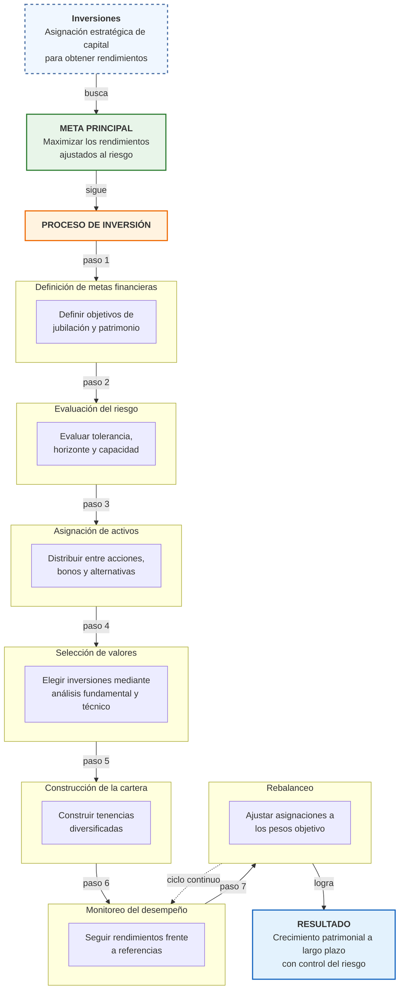

```mermaid
flowchart TD
    A[<b>Inversiones</b><br>Asignación estratégica de capital<br>para obtener rendimientos]:::title
    B[<b>META PRINCIPAL</b><br>Maximizar los rendimientos<br>ajustados al riesgo]:::goal
    C[<b>PROCESO DE INVERSIÓN</b>]:::process
    
    subgraph D[Definición de metas financieras]
        D1[Definir objetivos de<br>jubilación y patrimonio]
    end
    
    subgraph E[Evaluación del riesgo]
        E1[Evaluar tolerancia,<br>horizonte y capacidad]
    end
    
    subgraph F[Asignación de activos]
        F1[Distribuir entre acciones,<br>bonos y alternativas]
    end
    
    subgraph G[Selección de valores]
        G1[Elegir inversiones mediante<br>análisis fundamental y técnico]
    end
    
    subgraph H[Construcción de la cartera]
        H1[Construir tenencias<br>diversificadas]
    end
    
    subgraph I[Monitoreo del desempeño]
        I1[Seguir rendimientos frente<br>a referencias]
    end
    
    subgraph J[Rebalanceo]
        J1[Ajustar asignaciones a<br>los pesos objetivo]
    end
    
    K[<b>RESULTADO</b><br>Crecimiento patrimonial a largo plazo<br>con control del riesgo]:::outcome
    
    A -->|busca| B
    B -->|sigue| C
    C -->|paso 1| D
    D -->|paso 2| E
    E -->|paso 3| F
    F -->|paso 4| G
    G -->|paso 5| H
    H -->|paso 6| I
    I -->|paso 7| J
    J -->|logra| K
    J -.->|ciclo continuo| I
    
    classDef title fill:#f0f7ff,stroke:#4a6fa5,stroke-width:2px,color:#333,stroke-dasharray:5 5
    classDef goal fill:#e8f5e9,stroke:#2e7d32,stroke-width:2px,color:#333
    classDef process fill:#fff3e0,stroke:#ef6c00,stroke-width:2px,color:#333
    classDef outcome fill:#e3f2fd,stroke:#1565c0,stroke-width:2px,color:#333
```
