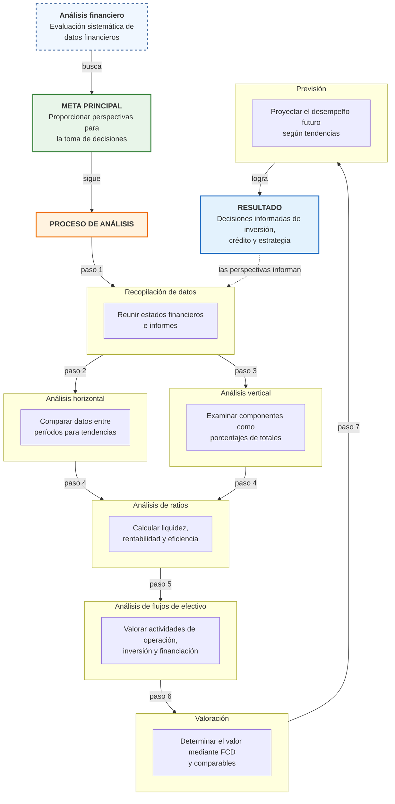

```mermaid
flowchart TD
    A[<b>Análisis financiero</b><br>Evaluación sistemática de<br>datos financieros]:::title
    B[<b>META PRINCIPAL</b><br>Proporcionar perspectivas para<br>la toma de decisiones]:::goal
    C[<b>PROCESO DE ANÁLISIS</b>]:::process
    
    subgraph D[Recopilación de datos]
        D1[Reunir estados financieros<br>e informes]
    end
    
    subgraph E[Análisis horizontal]
        E1[Comparar datos entre<br>períodos para tendencias]
    end
    
    subgraph F[Análisis vertical]
        F1[Examinar componentes como<br>porcentajes de totales]
    end
    
    subgraph G[Análisis de ratios]
        G1[Calcular liquidez,<br>rentabilidad y eficiencia]
    end
    
    subgraph H[Análisis de flujos de efectivo]
        H1[Valorar actividades de operación,<br>inversión y financiación]
    end
    
    subgraph I[Valoración]
        I1[Determinar el valor mediante FCD<br>y comparables]
    end
    
    subgraph J[Previsión]
        J1[Proyectar el desempeño futuro<br>según tendencias]
    end
    
    K[<b>RESULTADO</b><br>Decisiones informadas de inversión,<br>crédito y estrategia]:::outcome
    
    A -->|busca| B
    B -->|sigue| C
    C -->|paso 1| D
    D -->|paso 2| E
    D -->|paso 3| F
    E & F -->|paso 4| G
    G -->|paso 5| H
    H -->|paso 6| I
    I -->|paso 7| J
    J -->|logra| K
    K -.->|las perspectivas informan| D
    
    classDef title fill:#f0f7ff,stroke:#4a6fa5,stroke-width:2px,color:#333,stroke-dasharray:5 5
    classDef goal fill:#e8f5e9,stroke:#2e7d32,stroke-width:2px,color:#333
    classDef process fill:#fff3e0,stroke:#ef6c00,stroke-width:2px,color:#333
    classDef outcome fill:#e3f2fd,stroke:#1565c0,stroke-width:2px,color:#333
```
