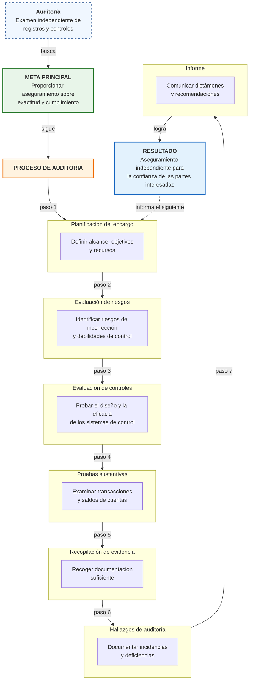

```mermaid
flowchart TD
    A[<b>Auditoría</b><br>Examen independiente de<br>registros y controles]:::title
    B[<b>META PRINCIPAL</b><br>Proporcionar aseguramiento sobre<br>exactitud y cumplimiento]:::goal
    C[<b>PROCESO DE AUDITORÍA</b>]:::process
    
    subgraph D[Planificación del encargo]
        D1[Definir alcance, objetivos<br>y recursos]
    end
    
    subgraph E[Evaluación de riesgos]
        E1[Identificar riesgos de incorrección<br>y debilidades de control]
    end
    
    subgraph F[Evaluación de controles]
        F1[Probar el diseño y la eficacia<br>de los sistemas de control]
    end
    
    subgraph G[Pruebas sustantivas]
        G1[Examinar transacciones<br>y saldos de cuentas]
    end
    
    subgraph H[Recopilación de evidencia]
        H1[Recoger documentación<br>suficiente]
    end
    
    subgraph I[Hallazgos de auditoría]
        I1[Documentar incidencias<br>y deficiencias]
    end
    
    subgraph J[Informe]
        J1[Comunicar dictámenes<br>y recomendaciones]
    end
    
    K[<b>RESULTADO</b><br>Aseguramiento independiente para<br>la confianza de las partes interesadas]:::outcome
    
    A -->|busca| B
    B -->|sigue| C
    C -->|paso 1| D
    D -->|paso 2| E
    E -->|paso 3| F
    F -->|paso 4| G
    G -->|paso 5| H
    H -->|paso 6| I
    I -->|paso 7| J
    J -->|logra| K
    K -.->|informa el siguiente| D
    
    classDef title fill:#f0f7ff,stroke:#4a6fa5,stroke-width:2px,color:#333,stroke-dasharray:5 5
    classDef goal fill:#e8f5e9,stroke:#2e7d32,stroke-width:2px,color:#333
    classDef process fill:#fff3e0,stroke:#ef6c00,stroke-width:2px,color:#333
    classDef outcome fill:#e3f2fd,stroke:#1565c0,stroke-width:2px,color:#333
```
