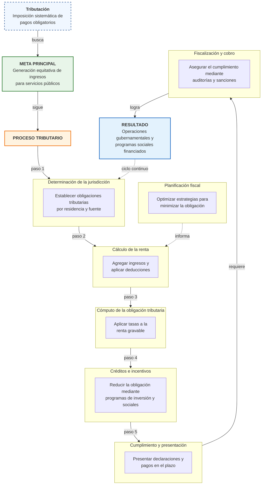

```mermaid
flowchart TD
    A[<b>Tributación</b><br>Imposición sistemática de<br>pagos obligatorios]:::title
    B[<b>META PRINCIPAL</b><br>Generación equitativa de ingresos<br>para servicios públicos]:::goal
    C[<b>PROCESO TRIBUTARIO</b>]:::process
    
    subgraph D[Determinación de la jurisdicción]
        D1[Establecer obligaciones tributarias<br>por residencia y fuente]
    end
    
    subgraph E[Cálculo de la renta]
        E1[Agregar ingresos y<br>aplicar deducciones]
    end
    
    subgraph F[Cómputo de la obligación tributaria]
        F1[Aplicar tasas a la<br>renta gravable]
    end
    
    subgraph G[Créditos e incentivos]
        G1[Reducir la obligación mediante<br>programas de inversión y sociales]
    end
    
    subgraph H[Cumplimiento y presentación]
        H1[Presentar declaraciones y<br>pagos en el plazo]
    end
    
    subgraph I[Planificación fiscal]
        I1[Optimizar estrategias para<br>minimizar la obligación]
    end
    
    subgraph J[Fiscalización y cobro]
        J1[Asegurar el cumplimiento mediante<br>auditorías y sanciones]
    end
    
    K[<b>RESULTADO</b><br>Operaciones gubernamentales y<br>programas sociales financiados]:::outcome
    
    A -->|busca| B
    B -->|sigue| C
    C -->|paso 1| D
    D -->|paso 2| E
    E -->|paso 3| F
    F -->|paso 4| G
    G -->|paso 5| H
    I -.->|informa| E
    H -->|requiere| J
    J -->|logra| K
    K -.->|ciclo continuo| D
    
    classDef title fill:#f0f7ff,stroke:#4a6fa5,stroke-width:2px,color:#333,stroke-dasharray:5 5
    classDef goal fill:#e8f5e9,stroke:#2e7d32,stroke-width:2px,color:#333
    classDef process fill:#fff3e0,stroke:#ef6c00,stroke-width:2px,color:#333
    classDef outcome fill:#e3f2fd,stroke:#1565c0,stroke-width:2px,color:#333
```
