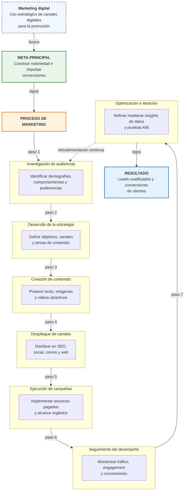

```mermaid
flowchart TD
    A[<b>Marketing digital</b><br>Uso estratégico de canales digitales<br>para la promoción]:::title
    B[<b>META PRINCIPAL</b><br>Construir notoriedad e impulsar<br>conversiones]:::goal
    C[<b>PROCESO DE MARKETING</b>]:::process
    
    subgraph D[Investigación de audiencias]
        D1[Identificar demografías,<br>comportamientos y preferencias]
    end
    
    subgraph E[Desarrollo de la estrategia]
        E1[Definir objetivos, canales<br>y temas de contenido]
    end
    
    subgraph F[Creación de contenido]
        F1[Producir texto, imágenes<br>y videos atractivos]
    end
    
    subgraph G[Despliegue de canales]
        G1[Distribuir en SEO,<br>social, correo y web]
    end
    
    subgraph H[Ejecución de campañas]
        H1[Implementar anuncios pagados<br>y alcance orgánico]
    end
    
    subgraph I[Seguimiento del desempeño]
        I1[Monitorear tráfico, engagement<br>y conversiones]
    end
    
    subgraph J[Optimización e iteración]
        J1[Refinar mediante insights de datos<br>y pruebas A/B]
    end
    
    K[<b>RESULTADO</b><br>Leads cualificados y conversiones<br>de clientes]:::outcome
    
    A -->|busca| B
    B -->|sigue| C
    C -->|paso 1| D
    D -->|paso 2| E
    E -->|paso 3| F
    F -->|paso 4| G
    G -->|paso 5| H
    H -->|paso 6| I
    I -->|paso 7| J
    J -->|logra| K
    J -.->|retroalimentación continua| D
    
    classDef title fill:#f0f7ff,stroke:#4a6fa5,stroke-width:2px,color:#333,stroke-dasharray:5 5
    classDef goal fill:#e8f5e9,stroke:#2e7d32,stroke-width:2px,color:#333
    classDef process fill:#fff3e0,stroke:#ef6c00,stroke-width:2px,color:#333
    classDef outcome fill:#e3f2fd,stroke:#1565c0,stroke-width:2px,color:#333
```
