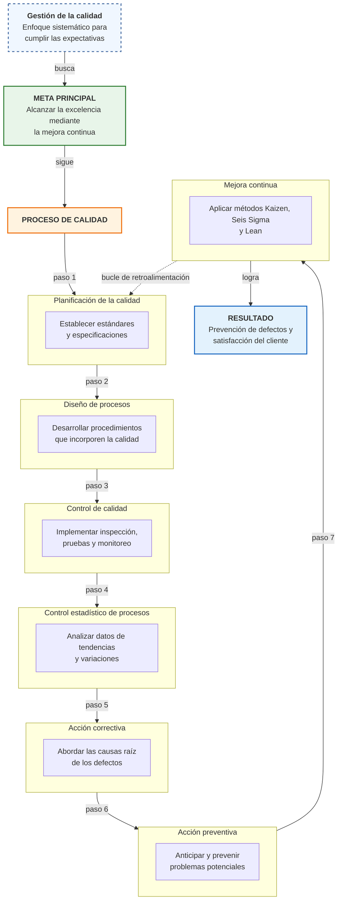

```mermaid
flowchart TD
    A[<b>Gestión de la calidad</b><br>Enfoque sistemático para<br>cumplir las expectativas]:::title
    B[<b>META PRINCIPAL</b><br>Alcanzar la excelencia mediante<br>la mejora continua]:::goal
    C[<b>PROCESO DE CALIDAD</b>]:::process
    
    subgraph D[Planificación de la calidad]
        D1[Establecer estándares<br>y especificaciones]
    end
    
    subgraph E[Diseño de procesos]
        E1[Desarrollar procedimientos<br>que incorporen la calidad]
    end
    
    subgraph F[Control de calidad]
        F1[Implementar inspección,<br>pruebas y monitoreo]
    end
    
    subgraph G[Control estadístico de procesos]
        G1[Analizar datos de tendencias<br>y variaciones]
    end
    
    subgraph H[Acción correctiva]
        H1[Abordar las causas raíz<br>de los defectos]
    end
    
    subgraph I[Acción preventiva]
        I1[Anticipar y prevenir<br>problemas potenciales]
    end
    
    subgraph J[Mejora continua]
        J1[Aplicar métodos Kaizen, Seis Sigma<br>y Lean]
    end
    
    K[<b>RESULTADO</b><br>Prevención de defectos y<br>satisfacción del cliente]:::outcome
    
    A -->|busca| B
    B -->|sigue| C
    C -->|paso 1| D
    D -->|paso 2| E
    E -->|paso 3| F
    F -->|paso 4| G
    G -->|paso 5| H
    H -->|paso 6| I
    I -->|paso 7| J
    J -->|logra| K
    J -.->|bucle de retroalimentación| D
    
    classDef title fill:#f0f7ff,stroke:#4a6fa5,stroke-width:2px,color:#333,stroke-dasharray:5 5
    classDef goal fill:#e8f5e9,stroke:#2e7d32,stroke-width:2px,color:#333
    classDef process fill:#fff3e0,stroke:#ef6c00,stroke-width:2px,color:#333
    classDef outcome fill:#e3f2fd,stroke:#1565c0,stroke-width:2px,color:#333
```
