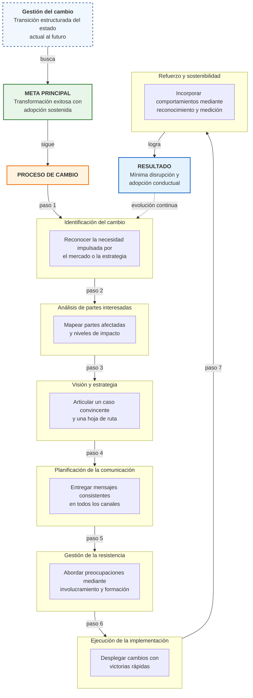

```mermaid
flowchart TD
    A[<b>Gestión del cambio</b><br>Transición estructurada del estado<br>actual al futuro]:::title
    B[<b>META PRINCIPAL</b><br>Transformación exitosa con<br>adopción sostenida]:::goal
    C[<b>PROCESO DE CAMBIO</b>]:::process
    
    subgraph D[Identificación del cambio]
        D1[Reconocer la necesidad impulsada por<br>el mercado o la estrategia]
    end
    
    subgraph E[Análisis de partes interesadas]
        E1[Mapear partes afectadas<br>y niveles de impacto]
    end
    
    subgraph F[Visión y estrategia]
        F1[Articular un caso convincente<br>y una hoja de ruta]
    end
    
    subgraph G[Planificación de la comunicación]
        G1[Entregar mensajes consistentes<br>en todos los canales]
    end
    
    subgraph H[Gestión de la resistencia]
        H1[Abordar preocupaciones mediante<br>involucramiento y formación]
    end
    
    subgraph I[Ejecución de la implementación]
        I1[Desplegar cambios con<br>victorias rápidas]
    end
    
    subgraph J[Refuerzo y sostenibilidad]
        J1[Incorporar comportamientos mediante<br>reconocimiento y medición]
    end
    
    K[<b>RESULTADO</b><br>Mínima disrupción y<br>adopción conductual]:::outcome
    
    A -->|busca| B
    B -->|sigue| C
    C -->|paso 1| D
    D -->|paso 2| E
    E -->|paso 3| F
    F -->|paso 4| G
    G -->|paso 5| H
    H -->|paso 6| I
    I -->|paso 7| J
    J -->|logra| K
    K -.->|evolución continua| D
    
    classDef title fill:#f0f7ff,stroke:#4a6fa5,stroke-width:2px,color:#333,stroke-dasharray:5 5
    classDef goal fill:#e8f5e9,stroke:#2e7d32,stroke-width:2px,color:#333
    classDef process fill:#fff3e0,stroke:#ef6c00,stroke-width:2px,color:#333
    classDef outcome fill:#e3f2fd,stroke:#1565c0,stroke-width:2px,color:#333
```
