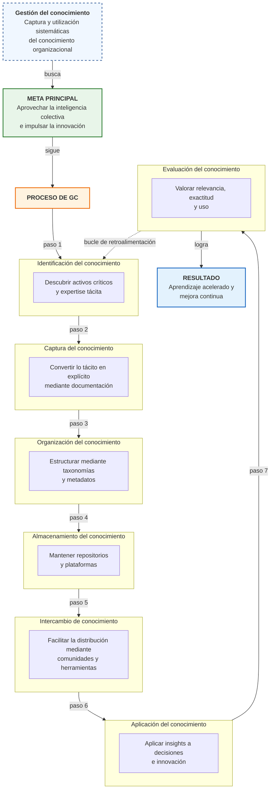

```mermaid
flowchart TD
    A[<b>Gestión del conocimiento</b><br>Captura y utilización sistemáticas<br>del conocimiento organizacional]:::title
    B[<b>META PRINCIPAL</b><br>Aprovechar la inteligencia colectiva<br>e impulsar la innovación]:::goal
    C[<b>PROCESO DE GC</b>]:::process
    
    subgraph D[Identificación del conocimiento]
        D1[Descubrir activos críticos<br>y expertise tácita]
    end
    
    subgraph E[Captura del conocimiento]
        E1[Convertir lo tácito en explícito<br>mediante documentación]
    end
    
    subgraph F[Organización del conocimiento]
        F1[Estructurar mediante taxonomías<br>y metadatos]
    end
    
    subgraph G[Almacenamiento del conocimiento]
        G1[Mantener repositorios<br>y plataformas]
    end
    
    subgraph H[Intercambio de conocimiento]
        H1[Facilitar la distribución mediante<br>comunidades y herramientas]
    end
    
    subgraph I[Aplicación del conocimiento]
        I1[Aplicar insights a decisiones<br>e innovación]
    end
    
    subgraph J[Evaluación del conocimiento]
        J1[Valorar relevancia, exactitud<br>y uso]
    end
    
    K[<b>RESULTADO</b><br>Aprendizaje acelerado y<br>mejora continua]:::outcome
    
    A -->|busca| B
    B -->|sigue| C
    C -->|paso 1| D
    D -->|paso 2| E
    E -->|paso 3| F
    F -->|paso 4| G
    G -->|paso 5| H
    H -->|paso 6| I
    I -->|paso 7| J
    J -->|logra| K
    J -.->|bucle de retroalimentación| D
    
    classDef title fill:#f0f7ff,stroke:#4a6fa5,stroke-width:2px,color:#333,stroke-dasharray:5 5
    classDef goal fill:#e8f5e9,stroke:#2e7d32,stroke-width:2px,color:#333
    classDef process fill:#fff3e0,stroke:#ef6c00,stroke-width:2px,color:#333
    classDef outcome fill:#e3f2fd,stroke:#1565c0,stroke-width:2px,color:#333
```
