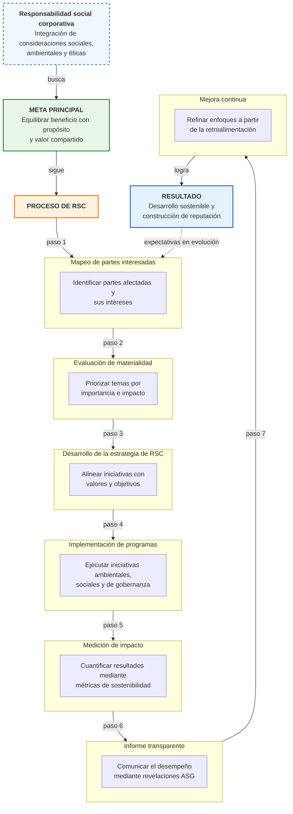

```mermaid
flowchart TD
    A[<b>Responsabilidad social corporativa</b><br>Integración de consideraciones sociales,<br>ambientales y éticas]:::title
    B[<b>META PRINCIPAL</b><br>Equilibrar beneficio con propósito<br>y valor compartido]:::goal
    C[<b>PROCESO DE RSC</b>]:::process
    
    subgraph D[Mapeo de partes interesadas]
        D1[Identificar partes afectadas y<br>sus intereses]
    end
    
    subgraph E[Evaluación de materialidad]
        E1[Priorizar temas por<br>importancia e impacto]
    end
    
    subgraph F[Desarrollo de la estrategia de RSC]
        F1[Alinear iniciativas con<br>valores y objetivos]
    end
    
    subgraph G[Implementación de programas]
        G1[Ejecutar iniciativas ambientales,<br>sociales y de gobernanza]
    end
    
    subgraph H[Medición de impacto]
        H1[Cuantificar resultados mediante<br>métricas de sostenibilidad]
    end
    
    subgraph I[Informe transparente]
        I1[Comunicar el desempeño<br>mediante revelaciones ASG]
    end
    
    subgraph J[Mejora continua]
        J1[Refinar enfoques a partir<br>de la retroalimentación]
    end
    
    K[<b>RESULTADO</b><br>Desarrollo sostenible y<br>construcción de reputación]:::outcome
    
    A -->|busca| B
    B -->|sigue| C
    C -->|paso 1| D
    D -->|paso 2| E
    E -->|paso 3| F
    F -->|paso 4| G
    G -->|paso 5| H
    H -->|paso 6| I
    I -->|paso 7| J
    J -->|logra| K
    K -.->|expectativas en evolución| D
    
    classDef title fill:#f0f7ff,stroke:#4a6fa5,stroke-width:2px,color:#333,stroke-dasharray:5 5
    classDef goal fill:#e8f5e9,stroke:#2e7d32,stroke-width:2px,color:#333
    classDef process fill:#fff3e0,stroke:#ef6c00,stroke-width:2px,color:#333
    classDef outcome fill:#e3f2fd,stroke:#1565c0,stroke-width:2px,color:#333
```
