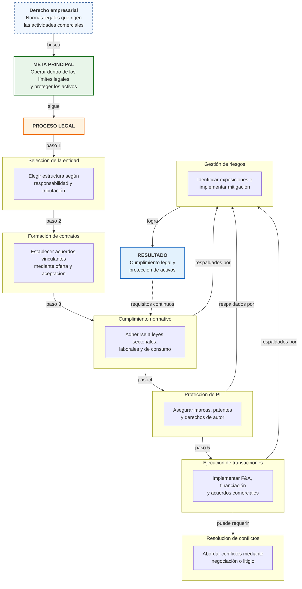

```mermaid
flowchart TD
    A[<b>Derecho empresarial</b><br>Normas legales que rigen<br>las actividades comerciales]:::title
    B[<b>META PRINCIPAL</b><br>Operar dentro de los límites legales<br>y proteger los activos]:::goal
    C[<b>PROCESO LEGAL</b>]:::process
    
    subgraph D[Selección de la entidad]
        D1[Elegir estructura según<br>responsabilidad y tributación]
    end
    
    subgraph E[Formación de contratos]
        E1[Establecer acuerdos vinculantes<br>mediante oferta y aceptación]
    end
    
    subgraph F[Cumplimiento normativo]
        F1[Adherirse a leyes sectoriales,<br>laborales y de consumo]
    end
    
    subgraph G[Protección de PI]
        G1[Asegurar marcas, patentes<br>y derechos de autor]
    end
    
    subgraph H[Ejecución de transacciones]
        H1[Implementar F&A, financiación<br>y acuerdos comerciales]
    end
    
    subgraph I[Resolución de conflictos]
        I1[Abordar conflictos mediante<br>negociación o litigio]
    end
    
    subgraph J[Gestión de riesgos]
        J1[Identificar exposiciones e<br>implementar mitigación]
    end
    
    K[<b>RESULTADO</b><br>Cumplimiento legal y<br>protección de activos]:::outcome
    
    A -->|busca| B
    B -->|sigue| C
    C -->|paso 1| D
    D -->|paso 2| E
    E -->|paso 3| F
    F -->|paso 4| G
    G -->|paso 5| H
    H -->|puede requerir| I
    F & G & H -->|respaldados por| J
    J -->|logra| K
    K -.->|requisitos continuos| F
    
    classDef title fill:#f0f7ff,stroke:#4a6fa5,stroke-width:2px,color:#333,stroke-dasharray:5 5
    classDef goal fill:#e8f5e9,stroke:#2e7d32,stroke-width:2px,color:#333
    classDef process fill:#fff3e0,stroke:#ef6c00,stroke-width:2px,color:#333
    classDef outcome fill:#e3f2fd,stroke:#1565c0,stroke-width:2px,color:#333
```
